# RTC - Experiments with Elixir

<h1 align="center"><b>DRAFT</b></h1>
<br/>

This is a "basic" `LiveView` app where we experiment processing videos streams with different protocles. We explore the `WebRTC` API, the `ExRTC` (`Elxiir` implementation of WebRTC), HTTP Live Streaming with `HLS` or `DASH`. We want to demonstrate how one can make and broadcast live transformations on images.

Our transformation will be the "Hello World" of computer vision, **face contouring**.

We heavily use `FFmpeg` and the Elixir libraries `ExWebERTC`, `Evision` (`OpenCV` made accessible to `Elixir`), `Porcelain` or `ExCmd` to interact with external programs (of the BEAM), and of course `Phoenix LiveView` and `Elixir.Channel`.

**:hash: What are we building?**

We will use the camera and microphone of the device to exchange media streams.
We want to use differents protocoles, thus different use cases, to broadcast our feed.
We also wante to transform our feed with _face contouring_.

We demonstrate the usage in the browser with `face-api.js`. We used the basic 200kB model powered by the (unzipped) library `face-api.js` of 600kB.

> :exclamation: It does not work with Firefox.

We explore HTTP Live Streaming (HLS). We transform the data on the server for face recognition and rebuild the segments which are available to the viewer.

We use the Javascript library "face-api" to track people.

We explore the WebRTC, using the browser. You can organize a live session, which we limited to 3 participants.
We explore ExWebRTC, an Elixir implementation. You can organize a live session with two participants.

This LiveView based app has "lobby" home page that displays tabs that allow you to:

- run a machine learning process from the video stream captured by the browser and pushed through the LiveView socket. With this technology, we cannot stream back a transformed video stream to the client. We can however display back some updates as found by the models.
- run an Echo ExWebRTC based server. We establish a WebRTC connection between the browser and a ExWebRTC server. This is a mirror: we send back to the browser what he sent back. Since we receive data on the server, we can manipulate it as well.
- run a peer-to-peer WebRTC conenction via the ExWebRTC server. You choose a room where two clients are connected via ExWebRTC and each will receive the other stream.
- demonstrate the WebRTC API. You choose a room and up to three clients are connected via WebRTC and each receive the two other streams.
- demonstrates the HLS and DASH for Live Streaming.

We added a `Presence` process.

**:hash: Quick review of possible technologies, ([cf Wiki page](https://developer.mozilla.org/en-US/docs/Web/Media/Audio_and_video_delivery/Live_streaming_web_audio_and_video)):**

- UPD based techs, for low latency and low quality: [RTP](https://en.wikipedia.org/wiki/Real-time_Transport_Protocol#:~:text=RTP%20typically%20runs%20over%20User,aids%20synchronization%20of%20multiple%20streams.) with [WebRTC](https://en.wikipedia.org/wiki/WebRTC),
- HTTP based techs: [MPEG-DASH](https://developer.mozilla.org/en-US/docs/Web/Media/Audio_and_video_delivery/Setting_up_adaptive_streaming_media_sources#mpeg-dash_encoding) (playback in the browser with [Dash.js](https://github.com/Dash-Industry-Forum/dash.js/)), and [HLS](https://developer.mozilla.org/en-US/docs/Web/Media/Audio_and_video_delivery/Setting_up_adaptive_streaming_media_sources#hls_encoding) (playback in the browser with [hsl.js](https://github.com/video-dev/hls.js)).

We will focus on:

**:hash: WebRTC**

> This technology is about making web apps capable of exchanging media content - audio and video - between browsers _without requiring an intermediary_. It is based on RTP. It uses codecs to compress data. The [WebRTC API](https://developer.mozilla.org/en-US/docs/Web/API/WebRTC_API) is natively implemented in (almsot every) web navigator.

> We will also use an Elixir implementation - [Elixir WebRTC](https://github.com/elixir-webrtc/ex_webrtc) - of the WebRTC to connect clients (named `ExWebRTC` here). It is a WebRTC gateway on the server.

**:hash: What is signaling?**

The WebRTC standards focus primarily on the media plane. Signaling functions – session setup and management – are left to the application.

To use WebRTC, you need to discover the IP address of the connected peers.

The _signaling process_ is the discovery of peers location and media format. You may need a third - mutually agreed-upon - server (STUN, TURN) for this.
The WebRTC process needs to discover the IP address of the clients to determine a way to exchange data between peers.

The _signaling server_ is the transport mechanism of the data exchange.


For the signaling process, we can:

- use the LiveView "/live" socket. Check [this paragraph](#signaling-process-with-the-liveview),
- use a custom WebSocket. We used this with `Elixir.Channel`, a process build on top of the custom WebSocket connection,
- use HTTP requests (the WHEP and WHIP protocoles). This is demonstrated in the [Elixir-WebRTC/Broadcaster repo](https://github.com/elixir-webrtc/apps/tree/master/broadcaster). It provides a simplified signaling process because of the HTTP-friendly approach: you don't need to establish a WebSocket connection. You use WHIP (Ingress) for clients to _send_ media streams to the server, and WHEP (Egress) for clients to _receive_ media streams from the server.

**:hash: What topopolgy?**

The native WebRTC uses a _full mesh_ topology: each user is connected with n-1 users, like the distributed Erlang.
The more connected users, the more bandwidth a single user will use as he has to send/receive data to/from n-1 users. Furthermore, each received stream has to be decoded, and each sent stream has to be encoded, very CPU demanding. Other topologies than mesh are needed, such as SFU and MCU.

The server based library `ex_webrtc` connects a client to a dedicated GenServer. To connect different peers, you exchange data between these GenServers, who will retransmit to their respective client.

**🧐 Why would you implement a server?**

When you need to process the streams, such as:

- saving the media into a file,
- using media processing algorithms or machine learning processing where some models need several Gb of RAM
- things that might be hard to do this in/from the browser!

<hr/>

## The TOC

- [RTC - Experiments with Elixir](#rtc---experiments-with-elixir)
  - [The TOC](#the-toc)
  - [Broadcast face contouring from the Face API](#broadcast-face-contouring-from-the-face-api)
    - [Push frames to the server](#push-frames-to-the-server)
      - [Push using WebSocket](#push-using-websocket)
      - [Push using HTTP request](#push-using-http-request)
      - [Overview](#overview)
      - [The "frame" hook](#the-frame-hook)
    - [Push video chunks](#push-video-chunks)
  - [Signaling process with the LiveView](#signaling-process-with-the-liveview)
  - [WebRTC](#webrtc)
    - [WebRTC signaling flow](#webrtc-signaling-flow)
      - [Connexion and SDP exchange](#connexion-and-sdp-exchange)
      - [Media streams](#media-streams)
      - [The ICE exchange](#the-ice-exchange)
    - [Flow for 3+ peers](#flow-for-3-peers)
      - [WebRTC 3+ client code](#webrtc-3-client-code)
      - [The Elixir signaling channel](#the-elixir-signaling-channel)
      - [Phoenix Channel client side](#phoenix-channel-client-side)
      - [Details of WebRTC objects](#details-of-webrtc-objects)
  - [ExWebRTC](#exwebrtc)
    - [Using channels](#using-channels)
      - [The server WebRTC process](#the-server-webrtc-process)
        - [Signaling module](#signaling-module)
    - [RTC module](#rtc-module)
    - [Example of ExWebRTC with an Echo server](#example-of-exwebrtc-with-an-echo-server)
    - [Example of ExWebRTC with two connected clients](#example-of-exwebrtc-with-two-connected-clients)
    - [Statistics and getting transfer rates with getStats](#statistics-and-getting-transfer-rates-with-getstats)
    - [Details of the process supervision](#details-of-the-process-supervision)
  - [HLS with an Elixir server](#hls-with-an-elixir-server)
    - [What is HLS](#what-is-hls)
    - [The process](#the-process)
    - [FileWatcher on the manifest file](#filewatcher-on-the-manifest-file)
    - [Proxy or CDN](#proxy-or-cdn)
  - [MPEG-DASH with an Elixir server](#mpeg-dash-with-an-elixir-server)
  - [Basics on Channel and Presence](#basics-on-channel-and-presence)
    - [Refresher (or not) on Erlang queue](#refresher-or-not-on-erlang-queue)
    - [Refresher on Channels, Custom sockets, Presence](#refresher-on-channels-custom-sockets-presence)
    - [Custom WebSocket connection](#custom-websocket-connection)
      - [Client-side](#client-side)
      - [Server-side](#server-side)
    - [WS Security](#ws-security)
    - [Channel set up](#channel-set-up)
    - [Logs and local testing](#logs-and-local-testing)
      - [Server logs](#server-logs)
      - [Testing on local network](#testing-on-local-network)
    - [LiveView navigation](#liveview-navigation)
    - [Presence](#presence)
      - [Set up](#set-up)
      - [Stream Presence](#stream-presence)
      - [A word on "hooks"](#a-word-on-hooks)

<hr/>

## Broadcast face contouring from the Face API

We have our video feed from our webcam. We want:

- to get frames from this video stream and send them to the server to run some transformations server-side on them,
- or upload these streams to the server as it is,
- or add a face contouring layer on top of it with `face-api.js` and send these transformed chunks to the server.

Once available, you can upload the chunks to the server:

- through a `WebSocket` (via the existing `LiveSocket` or preferably via a custom WebSocket exposed by a `Channel`)
- with an `HTTP POST` request
- using a `RTCPeerConnection` and `RTCDataChannel`.

**Get video streams**
You firstly get streams from the webcam with the WebRTC method `getUserMedia`. You get a `MediaStream`. You inject the stream into a `<video>` element (via the `srcObject`) and you preview your feed.

```js
this.video = document.querySelector("#webcam");
const stream = await navigator.mediaDevices.getUserMedia({ video: true });
this.video.srcObject = stream;
```

### Push frames to the server

You want to run some _object detection_ from your camera feed: you send a frame every (say) 500ms to run some heavy computations on it.

To capture a frame from a video stream, you "draw" an image from the `<video>` element into the `context` of a `<canvas>`:

```js
context = canvas.getContext('2d')
context.drawImage(video, ... coordinates, ...resizing coordinates)
```

> You can resize the image during this operation. If you use this image for ML purposes, you may want to match the models requirements and minimise the size of the data.

#### Push using WebSocket

If we want to use a WebSocket to send the data to the server, whether via the LiveSocket, or preferably via a custom WebSocket (Channel), you need to encode the data as a Base64 string.

> You could use `canvas.toDataURL` to convert the whole data into a B64 encoded string. However, the following is more efficient.

It is more efficient to use `canvas.toBlob` and work with the Blob. You can type the blob as "image/webp": this minimizes the weigth of the image a lot compared to PNG (the default) and eliminates the need to compress and decompress the data.

To transform a blob (immutable data), you need transform it into a `ArrayBuffer`: a chunk of memory with a fixed length (the length of the blob).
The ArrayBuffer can be mutated via types such has `Unit8Array`, typed arrays of usigned 8-bits integers.
We then can manipulate the Unit8Array by chunks of 32kB to produce a base64 encoded string.
This process lowers the memory impact and minimizes the data size.

If you use the LiveSocket, you receive the data in a `handle_event` callback in your LiveView. If you used a dedicated Channel (to separate concerns and let the LiveView handle only the UI), you receive the data in a `handle_in` callback in your Channel.

#### Push using HTTP request

You need to transform the `blob` as a **`File`** to append it to a `FormData`. It can then be sent by `fetch` to a `Phoenix` controller.
You will get a `%Plug_Upload{}` struct that contains a temporary path to your file.

#### Overview

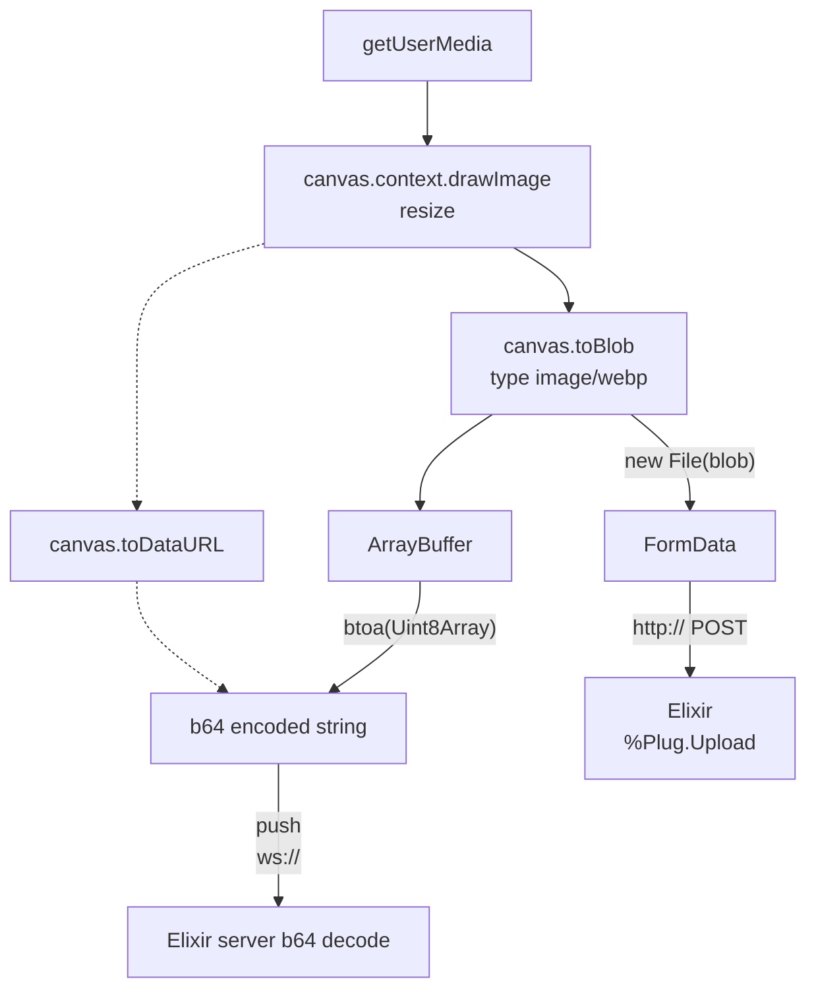
```mermaid
graph TD;
    A[getUserMedia] --> B[canvas.context.drawImage <br> resize]
    B-.->B1[canvas.toDataURL]
    B1-.->D
    B --> C1[canvas.toBlob <br>type image/webp]
    C1-->C2[ArrayBuffer]
    C2 --btoa(Uint8Array)--> D[b64 encoded string]
    D -- push <br>ws:// --> E[Elixir server b64 decode]
    C1 -- new File(blob) -->F[FormData]
    F -- http:// POST  -->E1[Elixir <br> %Plug.Upload]
```

<br/>

#### The "frame" hook

<br/>

<details>
  <summary>
    A hook to capture a frame and push to the server via liveSocket
  </summary>

```js
const frame = {
  intId: null,
  video: null,
  localStream: null

  async mounted() {
    const _this = this,
      mediaConstraints = {
      video: {
        facingMode: "user",
        frameRate: { ideal: 30 },
        width: { ideal: 1900 },
        height: { ideal: 1500 },
      },
      audio: false,
    };

    // setup channel
    this.channel = streamSocket.channel("stream:frame", { userId });
    this.channel
      .join()
      .receive("error", (resp) => {
        console.log("Unable to join", resp);
      })
      .receive("ok", () => {
        console.log(`Joined successfully stream:frame`);
      });

    this.video = document.querySelector("#webcam");

    const stream = await navigator.mediaDevices.getUserMedia(mediaConstraints);
    this.intId = setInterval(captureFrame, 500, this.video);
    this.video.srcObject = stream;

    // to be able stop stream when leave the page (destroyed)
    this.localStream = stream;

    async function captureFrame(video) {
      const canvas = document.createElement("canvas"),
        ctx = canvas.getContext("2d"),
        w = video.videoWidth,
        h = video.videoHeight,
        targetW = 244,
        targetH = 244 * (h / w);

      /* Capture a frame by drawing into a canvas and resize image
      to the target dimensions to match the model requirements */
      ctx.drawImage(video, 0, 0, w, h, 0, 0, targetW, targetH);

      /* We need to pass the data as B64 encoded string as LiveView accepts only strings.
      It is more efficient to canvas.toBlob and work on the Blob than directly convert the datanwith canvas.toDataURL into a B64 encoded string.
      You also convert the canvas content to WEBP format in the canvas.toBlbob. */

      // convert the data into a Blob typed as WEBP
      const { promise, resolve } = Promise.withResolvers();
      canvas.toBlob(resolve, "image/webp", 0.9);
      const blob = await promise;

      checkCapture(blob)

      // convert immutable Blob into mutable object
      const arrayBuffer = await blob.arrayBuffer();
      //
      const encodedB64 = arrayBufferToB64(arrayBuffer);

      _this.channel.push("frame",  msg)
      // _this.pushEvent("frame", { data: encodedB64 });
      // or fetch(...)
      // or via RTCDataChannel
    }

    function arrayBufferToB64(arrayBuffer) {
      // convert the ArrayBuffer to a binary string
      const bytes = new Uint8Array(arrayBuffer);
      const chunkSize = 0x8000; // 32KB chunks
      const chunks = [];
      // convert chunks of Uint8Array to binary strings and encode them to base64
      for (let i = 0; i < bytes.byteLength; i += chunkSize) {
        const chunk = bytes.subarray(i, i + chunkSize);
        const binaryString = Array.from(chunk)
          .map((byte) => String.fromCharCode(byte))
          .join("");
        chunks.push(btoa(binaryString));
      }
      return chunks.join("");
    }
  },

  destroyed() {
    clearInterval(this.intId);
    this.localStream.getTracks().forEach((track) => track.stop());
    this.localStream = null;
    this.video = null;
    if (this.channel) {
      this.channel.leave();
    }
    console.log("destroyed");
  },
};

export default frame
```

</details>
<br/>

> You can check the captured image by creating an `` element in your DOM and pass it the data as dataURL:

<details>
  <summary>
    Check your frame
  </summary>

```js
function checkCapture(blob) {
  const imgURL = URL.createObjectURL(blob);
  const imgElement = document.querySelector("#test-img");
  imgElement.src = imgURL;
  imgElement.onload = () => {
    URL.revokeObjectURL(imgURL);
  };
}
```

</details>
<br/>

For example, we push a 10 kB image with a processing time (browser) less than 20 ms per image.
We could process this way 1000/20 = 50fps, transfering only 0.5MB/s per client through the socket.

### Push video chunks

You want to broadcast our feed and send **chunks**.

Once the `<video>` element has started to play the feed, we invoque `video.captureStream(20 fps)` and feed a `MediaRecorder`.

```js
mediaStream = video.captureStream(20);
mediaRecorder = new MediaRecorder(mediaStream, { mimeType: "video/webm" });
```

We have several ways to send these chunks to the server:

- use `FileReader`, mainly used for static files. You must `captureStream` to get a blob.
- use `Streams API`, for video streams: you can use _directly_ the stream from the video element.

Then, either you can proceed with b64 encoded strings (and use a WebSocket) or files (and send an HTTP POST multipart request).

- use `FileReader`, save the blob into a File, add it to a FormData and make a HTTP POST multipart request to an Elixir controller,
- use the `Streams API`, open a ReadableStream, use a WriteableStream to make an HTTP POST multipart request to an Elixir controller.

We want to draw contours around the faces we found. We can do this in a canvas and superimpose the canvas upon the current video element. This gives the impression of contour detection.

But we want more: we want the video chunks and the contour overlay in the data.
For this, we draw an animation `requestAnimationFrame`. It takes a function as argument, the function that draws the update and recursively calls itself. This naturally comes with limitations.

The process is more easily visualized in a graph.

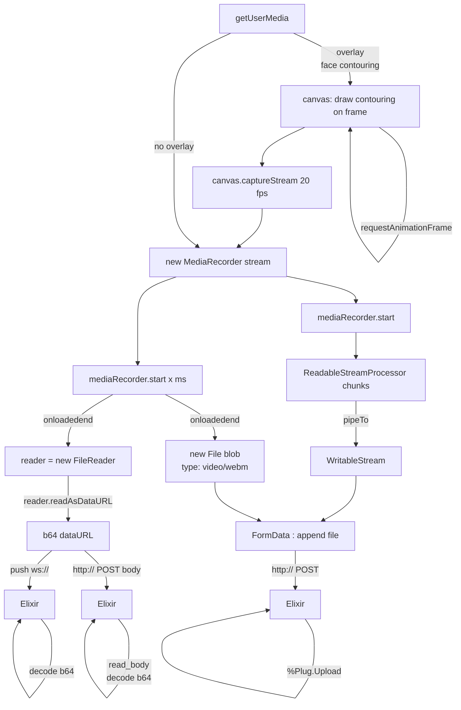
```mermaid
graph TD;
    A[getUserMedia] -- overlay<br> face contouring --> B1[canvas: draw contouring on frame]
    B1--requestAnimationFrame-->B1
    B1 --> C[canvas.captureStream 20 fps]
    C --> D[new MediaRecorder stream]
    D --> E[mediaRecorder.start x ms]
    E -- onloadedend -->F1[reader = new FileReader]
    F1-- reader.readAsDataURL -->G[b64 dataURL]
    G-- push ws://-->H1[Elixir]
    H1--decode b64 --> H1
    G--http:// POST body -->H2[Elixir]
    H2 -- read_body <br> decode b64 --> H2

    D --> E2[mediaRecorder.start]
    E2 --> R[ReadableStreamProcessor chunks]
    R --pipeTo --> W[WritableStream]
    W-->G2
    A -- no overlay -->D
    E -- onloadedend -->F2[new File blob <br> type: video/webm]
    F2 --> G2[FormData : append file]
    G2 --http:// POST --> H3[Elixir]
    H3 -- %Plug.Upload --> H3
```

<br/>

It remains to send this to the server. We need to transform it into a base64 encoded string. We can use `canvas.toDataURL` which is available on the canvas. However, this increases the size (+2/6). The canvas element has also the `canvas.toBlob`. From there, we transform the immutable blob into an ArrayBuffer composed of Unit8Array on which we work to encode into b64 with `btoa` (which is limited to 16_000 characters). With this in place, we can push through the WebSocket.

When we deal with chunks, we have blobs. We send them to the server with a POST HTTP request and use a `FormData`. We can then receive the data from a controller which has `:multipart` in his pipeline.
One important point is to use `new File(blob)` as Phoenix won't accept the blob as such, only containerized as a file.

- you get a chunk when you `stream.captureStream(20 fps)`.

get a video stream, capture a frame into a `<canvas>` element, and push it to the server via the LiveSocket.

<details>
  <summary>Hook to push video chunks via HTTP POST requests</summary>

```js
export const faceApi = {
  localStream: null,
  mediaRecorder: null,
  requestId: null,

  async mounted() {
    // the webcam feed
    const video = document.getElementById("webcam"),
      // the transformed video with the detected contours
      overlayed = document.getElementById("overlayed"),
      displaySize = { width: video.width, height: video.height },
      _this = this;

    // we louad the libraries
    const [faceapi, stream] = await Promise.all([
      import("@vladmandic/face-api"),
      navigator.mediaDevices.getUserMedia({ video: true }),
    ]);

    await faceapi.nets.tinyFaceDetector.loadFromUri("/models/face-api");

    // display your webcam
    video.srcObject = stream;
    video.onloadeddata = video.play;

    // keep a reference to stop the video stream once the component is destroyed
    this.localStream = stream;

    let canvas = null;

    video.onplay = async () => {
      //  draw a canvas
      canvas = faceapi.createCanvasFromMedia(video);
      faceapi.matchDimensions(canvas, displaySize);

      await drawAnimationOnCanvas();
      // capture the animation drawn in the canvas at 20 fps
      const canvasStream = canvas.captureStream(20);
      // reference to cancel the recording when the component is destroyed
      this.mediaRecorder = new MediaRecorder(canvasStream);
      // start recording chunks at 5 fps, ie of length 1000/5=200 ms
      const fps = 5;
      this.mediaRecorder.start(1000 / fps);
      // given it to the MediaRecorder and HTTP request to the server
      this.mediaRecorder.ondataavailable = sendBlobToServer;
      // visualizing the animation in the second video
      overlayed.srcObject = canvasStream;

      // we can also broadcast the stream with RTCPeerConnection
      // canvasStream.getTracks().forEach((track) => {...})
    };

    await drawAnimationOnCanvas();
    // capture the animation drawn in the canvas at 20 fps
    const canvasStream = canvas.captureStream(20);
    // reference to cancel the recording when the component is destroyed
    this.mediaRecorder = new MediaRecorder(canvasStream);
    // start recording chunks at 5 fps, ie of length 1000/5=200 ms
    const fps = 5;
    this.mediaRecorder.start(1000 / fps);
    // given it to the MediaRecorder and HTTP request to the server
    this.mediaRecorder.ondataavailable = sendBlobToServer;
    // visualizing the animation in the second video
    overlayed.srcObject = canvasStream;

    // we can also broadcast the stream with RTCPeerConnection
    // canvasStream.getTracks().forEach((track) => {...})

    async function sendBlobToServer({ data }) {
      if (data.size > 0) {
        const file = new File([data], "chunk.webm", {
          type: "video/webm",
        });
        const formData = new FormData();
        formData.append("file", file);

        return fetch(`${window.location.origin}/face-api/upload`, {
          method: "POST",
          body: formData,
        });
      }
    }
  },

  destroyed() {
    console.log("destroyed");
    if (this.requestId) cancelAnimationFrame(id);

    this.requestId = null;

    if (this.localStream) {
      this.localStream.getTracks().forEach((track) => track.stop());
    }
    if (this.mediaRecorder) this.mediaRecorder.stop();
  },
};
```

</details>
<br/>

## Signaling process with the LiveView

`LiveView` uses a WebSocket connection between the client and the server.

When we use the `ex_webrtc` library, each client communicates to the server. The "live" socket could be used for signaling.

Upon a client connection, the server will start a `ex_webrtc` process. The diagram below describes the message passing, cf [LiveView client-server communication](https://hexdocs.pm/phoenix_live_view/js-interop.html#client-server-communication)

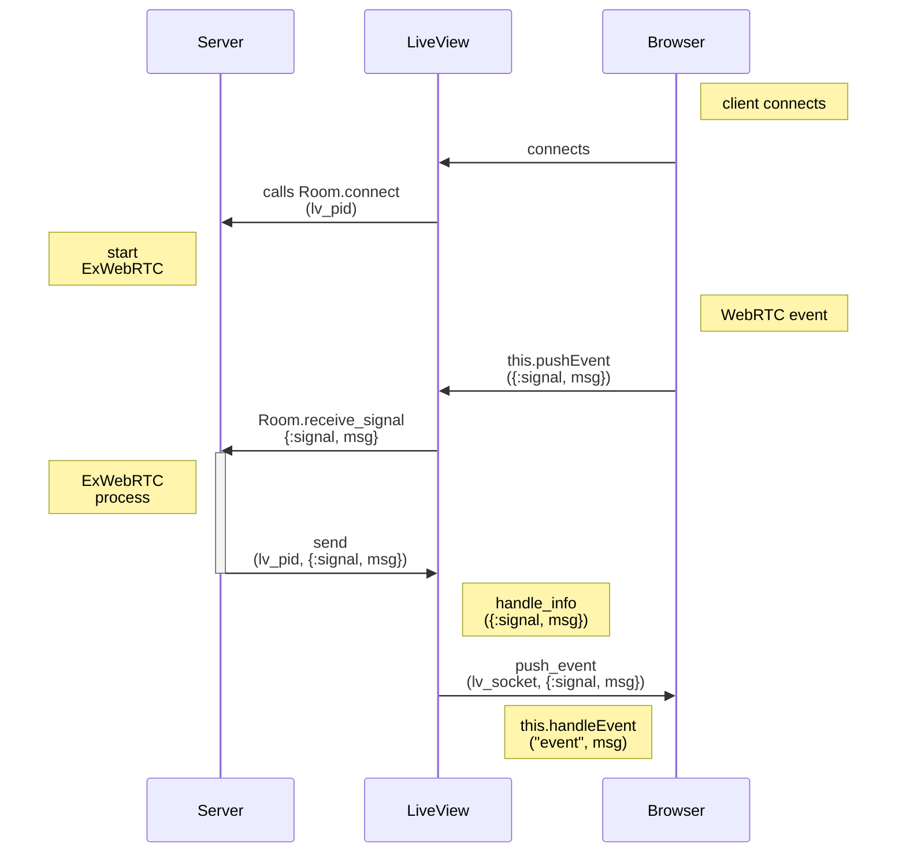
```mermaid
sequenceDiagram
  participant Server
  participant LiveView
  participant Browser

  Note right of Browser: client connects
  Browser ->>LiveView: connects
  LiveView ->> Server: calls Room.connect <br> (lv_pid)
  Note left of Server: start <br>ExWebRTC

  Note right of Browser: WebRTC event
  Browser ->> LiveView: this.pushEvent<br>({:signal, msg})
  LiveView ->> Server: Room.receive_signal<br>{:signal, msg}
  activate Server
  Note left of Server: ExWebRTC<br>process
  Server ->> LiveView: send <br>(lv_pid, {:signal, msg})
  deactivate Server
  Note right of LiveView: handle_info<br>({:signal, msg})
  LiveView ->> Browser: push_event<br>(lv_socket, {:signal, msg})
  Note left of Browser: this.handleEvent<br>("event", msg)
```

The event handler in the LiveView to `this.pushEvent` from the client:

```elixir
def handle_event("signal", msg, socket) do
  Rtc.Room.receive_signaling_msg(socket.assigns.room_id, msg)
  {:noreply, socket |> push_event(msg["type"], msg)}
end
```

The message handler in the LiveView to a `Kernel.send` from the `ExWebRTC` server:

```elixir
@impl true
def handle_info({:signaling, %{"type" => type} = msg}, socket) do
  {:noreply, socket |> push_event(type, msg)}
end
```

In this configuration, we will push and receive data to other peers, ie other LiveViews: messages are not flowing between LiveViews.

We would need to **broadcast** messages to spread it among the different LiveView processes.

To separate the concerns, we used the Channel API since joining peers will connect to the same Channel topic. The primitives are easy: two Javascript methods `channel.push`, `channel.on`, and one Elixir listener `handle_in` that runs a `broadcast_from`.

[:arrow_up:](#rtc---demo-of-elixir-and-webrtc)

## WebRTC

### WebRTC signaling flow

Source :<https://developer.mozilla.org/en-US/docs/Web/API/WebRTC_API/Signaling_and_video_calling#signaling_transaction_flow>

We have three flows of data to exchange between peers: SDP, streams and ICE.

- the `ICE` protocol (Interactive Connectivity Establishment) is used to establish the path of the connections between peers. ICE candidates are delivered by a STUN server or TURN servers. In fact on localhost, you don't need anything!.
- the `SDP` protocol (Session Description Protocol) is used to describe how to set up multimedia session between peers. The data contains informations such as the codecs. It negotiates the RTP (Real Time Protocol). The SCTCP (Stream Control Transmission Protocol) manages the data transport, in particular for the `DataChannel` API.
- media streams captured by `mediaDevices.getUserMedia`.

The WebRTC process is fully managed by the browser's WebRTC API. You only need to code the sequence of the data exchange between peers.


> The signaling process that transports the data between peers can use WebSockets or HTTP requests.
> If we use WebSockets, we can use:
>
> - directly the LiveView socket. Check [this paragraph](#signaling-process-with-the-liveview),
> - use `Elixir.Channel`, a process running on top of a custom WebSocket connection between the browser and the Phoenix server.

> This connection is usefull only during the lifetime of the set up of the connection. You can even shut down the server afterwards, the RTC connection will persist.

#### Connexion and SDP exchange

Source: [MDN Session description](https://developer.mozilla.org/en-US/docs/Web/API/WebRTC_API/Connectivity#session_descriptions)

1. The caller captures local Media via `MediaDevices.getUserMediagetUserMedia`.
2. The caller creates `pc = new RTCPeerConnection()` and calls `RTCPeerConnection.addTrack()`.
3. The caller calls `pc.createOffer()`to create an offer.
4. The caller calls `pc.setLocalDescription()` to set that offer as the local description (that is, the description of the local end of the connection).
5. After `setLocalDescription()`, the caller asks STUN servers to generate the ice candidates
6. The caller uses the signaling server to transmit the offer to the intended receiver of the call.
7. The recipient receives the offer and calls `pc.setRemoteDescription()` to record it as the remote description (the description of the other end of the connection).
8. The recipient does any setup it needs to do for its end of the call: capture its local media, and attach each media tracks into the peer connection via `pc.addTrack()`.
9. The recipient then creates an answer by calling `pc.createAnswer()`.
10. The recipient calls `pc.setLocalDescription()`, passing in the created answer, to set the answer as its local description. The recipient now knows the configuration of both ends of the connection.
11. The recipient uses the signaling server to send the answer to the caller.
12. The caller receives the answer.
13. The caller calls `pc.setRemoteDescription()` to set the answer as the remote description for its end of the call. It now knows the configuration of both peers.

The SDP flow between two peers:

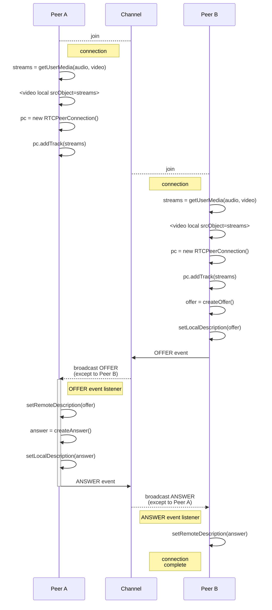
```mermaid
sequenceDiagram
  participant A as Peer A
  participant C as Channel
  participant B as Peer B

  A --> C: join
  Note right of A: connection
  A ->>A: streams = getUserMedia(audio, video)
  A->>A: <video local srcObject=streams>
  A->>A: pc = new RTCPeerConnection()
  A->>A: pc.addTrack(streams)


  B --> C: join
  Note left of B: connection
  B ->>B: streams = getUserMedia(audio, video)
  B->>B: <video local srcObject=streams>
  B ->>B: pc = new RTCPeerConnection()
  B ->>B: pc.addTrack(streams)
  B ->>B: offer = createOffer()
  B->>B: setLocalDescription(offer)
  B ->> C: OFFER event
  C -->> A: broadcast OFFER <br>(except to Peer B)
  activate A
  Note right of A: OFFER event listener
  A->>A: setRemoteDescription(offer)
  A->>A: answer = createAnswer()
  A->>A: setLocalDescription(answer)
  A ->> C: ANSWER event
  deactivate A
  C -->> B: broadcast ANSWER <br> (except to Peer A)
  Note left of B: ANSWER event listener
  B->>B: setRemoteDescription(answer)
  Note left of B: connection <br>complete
```

The code for two peers is [here](#rtc-module)

The WebRTC connection uses the `RTCPeerConnection` object. The final state of the object after the `SDP` exchange process and ICE process is described below.

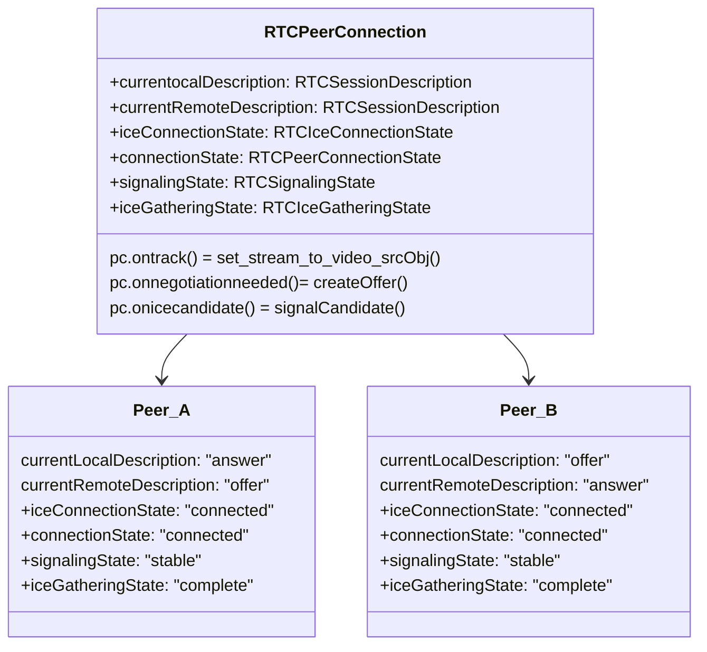
```mermaid
  classDiagram
  class RTCPeerConnection {
    +currentocalDescription: RTCSessionDescription
    +currentRemoteDescription: RTCSessionDescription

    +iceConnectionState: RTCIceConnectionState
    +connectionState: RTCPeerConnectionState
    +signalingState: RTCSignalingState
    +iceGatheringState: RTCIceGatheringState

    pc.ontrack() =  set_stream_to_video_srcObj()
    pc.onnegotiationneeded()= createOffer()
    pc.onicecandidate() = signalCandidate()
  }

    class Peer_A  {
        currentLocalDescription: "answer"
        currentRemoteDescription: "offer"
        +iceConnectionState: "connected"
        +connectionState: "connected"
        +signalingState: "stable"
        +iceGatheringState: "complete"
    }

    class Peer_B {
        currentLocalDescription: "offer"
        currentRemoteDescription: "answer"
        +iceConnectionState: "connected"
        +connectionState: "connected"
        +signalingState: "stable"
        +iceGatheringState: "complete"
    }
    RTCPeerConnection --> Peer_A
    RTCPeerConnection --> Peer_B
```

<br>

#### Media streams

The easiest process is the media stream. You invoque:

```js
navigator.mediaDevices.getUserMedia;
```

to access your local camera and microphone and receive streams from them.
You pass the streams to the `srcObj` attribute of a `<video>` et voilà, you have your local stream.

Once the communication is established between peers, the `RTCPeerConnection` protocole will send a "track" event. It returns remote streams. Your callback will simply pass them to the `scrObj` attribute of your other `<video>` element of your page. This will reflect the data from the remote camera.

#### The ICE exchange

Peers exchange ICE candidates in both directions to maximize the chances of etablishing the best direct connection.

To be able to process a candidate, a peer must have set his remote description. We must therefor store the received candidates until the peer PC can process it.

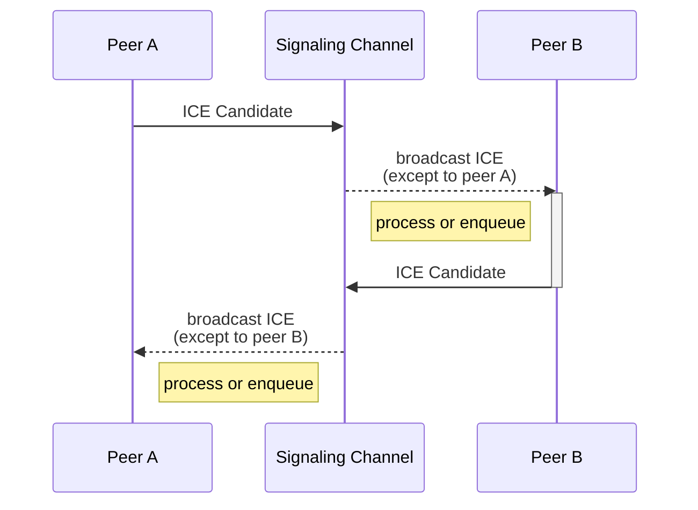
```mermaid
sequenceDiagram
  participant Peer A
  participant Signaling Channel
  participant Peer B

  Peer A ->> Signaling Channel: ICE Candidate
  Signaling Channel -->> Peer B: broadcast ICE <br>(except to peer A)
  activate Peer B
  Note left of Peer B: process or enqueue
  Peer B ->> Signaling Channel: ICE Candidate
  deactivate Peer B
  Signaling Channel -->> Peer A: broadcast ICE <br>(except to peer B)

  Note right of Peer A: process or enqueue
```

### Flow for 3+ peers

When a new peer A connects to the channel, the channel will broadcast an event NEW (from the server-side).
The listeners of the connected user B will react by creating a `new PeerConnection` instance for the new peer A. He will also send a PING signal to the peer A for him to start the reverse connection A->B upon reception. Then the SDP and ICE transactions can start.
We need to trace the PeerConnections between peers. Each peer will store an object whose keys are the IDs of the other connected peers and the RTCPeerConnection object. For example, if A, B and C are connected, then A has something like:

```js
pcs = {user_idB: RTC_pc(A->B), user_idC: RTC_pc(A->C)}
```

> :exclamation: In order not to _double the offers_, we used an **ordering function** between peers identifiers. In our case, the identifiers are numbers so we used the following rule: if `Id(A)<Id(B)`, then B will send an offer in the "negotiationneeded" callback. This works because the roles of peers are _inverted when viewed by the other peer_ (B becomes A, and A is B).

> Note that the case of connecting just two peers is simplified as it doesn't need any ordering, nor keeping track of the connections.

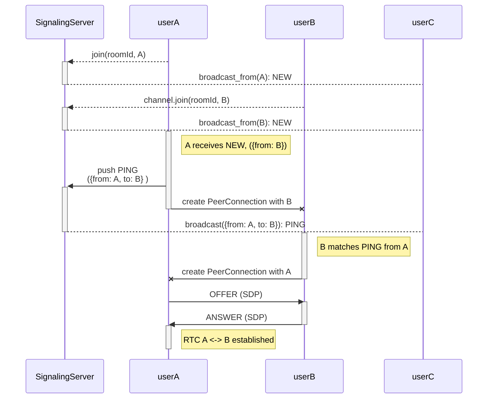
```mermaid
sequenceDiagram
    participant S as SignalingServer
    participant A as userA
    participant B as userB
    participant C as userC

    A-->>+S: join(roomId, A)
    S-->-C: broadcast_from(A): NEW


    B-->>+S: channel.join(roomId, B)
    S-->-C: broadcast_from(B): NEW
    activate A
    Note right of A: A receives NEW, ({from: B})
    A ->>+S: push PING<br> ({from: A, to: B} )
    A -xB: create PeerConnection with  B
    deactivate A
    S-->C: broadcast({from: A, to: B}): PING
    deactivate S
    activate B
    Note right of B: B matches PING from  A
    B -x A: create PeerConnection with A
    deactivate B

    A->>B: OFFER (SDP)
    activate B
    B->>A: ANSWER (SDP)
    deactivate B
    activate A
    Note right of A: RTC A <-> B established
    deactivate A
```

<br>

#### WebRTC 3+ client code

In the code below, we expose to the `window` object the "pcs" object that tracks the peer connections.
Each message passed through the channel will get a `{from, to}` object appended.

<details><summary>The 3+ WebRTC implementation</summary>

```js
import setPlayer from "./setPlayer.js";
import joinChannel from "./signalingChannel.js";

const configuration = {
  iceServers: [{ urls: "stun:stun.l.google.com:19302" }],
};
const mediaConstraints = {
  video: {
    facingMode: "user",
    frameRate: { ideal: 15 },
    width: { ideal: 320 },
    height: { ideal: 160 },
  },
  audio: true,
};

function order(userA, userB) {
  BigInt(userA) < BigInt(userB)
}

const RTC = {
  // global variables
  pcs: {},
  pc: null,
  pc_curr: null,
  channel: null,
  localStream: null,

  destroyed() {
    if (this.localStream) {
      this.localStream.getTracks().forEach((track) => track.stop());
      this.localStream = null;
    }

    if (this.channel) {
      this.channel.leave().receive("ok", () => {
        console.log("left room, closing channel", this.channel.topic);
      });
      this.channel = null;
    }
    if (this.pc) {
      this.pc.close();
      this.pc = null;
    }
    delete window.pc;
    delete window.pcs;
    console.log("destroyed");
  },

  async mounted() {
    let rtc = this,
      iceCandidatesQueue = [];

    const userId = document.querySelector("#room-view").dataset.userId;
    const roomId = window.location.pathname.slice(1).toString();

    async function handleOffer({ sdp, from, to }) {
      if (to !== userId) return;

      const pc = rtc.pcs[from];
      await pc.setRemoteDescription(sdp);
      const answer = await pc.createAnswer();
      await pc.setLocalDescription(answer);

      rtc.channel.push("answer", {
        sdp: pc.localDescription,
        type: "answer",
        from: to,
        to: from,
      });
    }

    async function handleAnswer({ from, to, sdp }) {
      if (to !== userId) return;
      const pc = rtc.pcs[from];

      await pc.setRemoteDescription(sdp);
      consumeIceCandidates(to);
    }

    async function handleCandidate({ candidate, from, to }) {
      if (to !== userId || !candidate) return;

      const pc = rtc.pcs[from];
      if (pc) {
        await pc.addIceCandidate(new RTCIceCandidate(candidate));
      } else {
        iceCandidatesQueue.push({ candidate, from });
      }
    }

    function createConnection({ user, peer }, stream) {
      const pc = new RTCPeerConnection(configuration);

      stream.getTracks().forEach((track) => pc.addTrack(track, stream));

      pc.onicecandidate = (event) => {
        if (event.candidate) {
          rtc.channel.push("ice", {
            candidate: event.candidate,
            type: "ice",
            from: user,
            to: peer,
          });
        }
      };

      pc.ontrack = ({ streams }) => {
        setPlayer("new", streams[0], peer);
      };

      pc.onnegotiationneeded = async () => {
        // only one of the 2 peers should create the offer
        if order(user,peer) return;

        const offer = await pc.createOffer();
        await pc.setLocalDescription(offer);

        rtc.channel.push("offer", {
          sdp: pc.localDescription,
          type: "offer",
          from: user,
          to: peer,
        });
      };

      pc.onconnectionstatechange = () => {
        const state = pc.connectionState;
        switch (state) {
          case "connected":
            console.log("~~> Connection state: ", state, { user, peer });
            console.log(rtc.pcs);
            break;
          case "disconnected":
          case "failed":
          case "closed":
            console.log("~~> Connection state: ", state, { user, peer });
            delete rtc.pcs[peer];
            rtc.destroyed();
            break;
          default:
            console.log("~~> Connection state: ", state, { user, peer });
            break;
        }
      };

      rtc.pcs[peer] = pc;
      window.pcs = rtc.pcs;

      return pc;
    }

    const handlers = {
      offer: handleOffer,
      answer: handleAnswer,
      ice: handleCandidate,
      ping: ({ from, to }) => {
        if (to !== userId) return;

        const peers = { user: userId, peer: from };
        rtc.pc = createConnection(peers, rtc.localStream);
      },
      new: ({ from, to }) => {
        const peers = { user: userId, peer: from };

        if (from !== userId && to === undefined) {
          rtc.channel.push("ping", { from: userId, to: from });
          rtc.pc = createConnection(peers, rtc.localStream);
        }
      },
    };

    this.localStream = await navigator.mediaDevices.getUserMedia(
      mediaConstraints
    );
    setPlayer("local", this.localStream);

    this.channel = await joinChannel(roomId, userId, handlers);

    function consumeIceCandidates(from) {
      while (iceCandidatesQueue.length > 0) {
        iceCandidatesQueue = iceCandidatesQueue.filter((item) => {
          if (item.from === from) {
            rtc.pcs[from].addIceCandidate(item.candidate);
            return false;
          }
          return true;
        });
      }
    }
  },
};

export default RTC;
```

</details>
<br/>

and the video player module helper (to add dynamically video tags):

<details><summary>The VideoPlayer module</summary>

```js
export default function setPlayer(eltId, stream, from = "") {
  let video;

  const remote = document.getElementById(from);

  if (eltId === "new" && remote === null) {
    video = document.createElement("video");
    video.id = from;
    video.setAttribute("class", "w-full h-full object-cover rounded-lg");

    const fig = document.createElement("figure");
    const figcap = document.createElement("figcaption");
    figcap.setAttribute("class", "text-red-500");
    figcap.textContent = from;
    document.querySelector("#videos").appendChild(fig);
    fig.appendChild(video);
    video.after(figcap);
  } else {
    if (eltId === "new" && remote !== null) {
      video = remote;
    } else {
      video = document.getElementById(eltId);
    }
  }
  video.srcObject = stream;
  video.controls = false;
  video.muted = true;
  video.playsInline = true;

  video.onloadeddata = (e) => {
    try {
      video.play();
    } catch (e) {
      console.error(e);
    }
  };
}
```

</details>
<br/>

#### The Elixir signaling channel

The "signaling_channel" Elixir implementation. It is the module that manages the Channel process attached to the custom WebSocket.
It uses `handle_in` callbacks from the client (the RTC.js module) and responds with `broadcast_from`.
The data just passes through.

```elixir
defmodule RtcWeb.SignalingChannel do
  use RtcWeb, :channel
  require Logger

  @impl true
  def join("room:" <> id = _room_id, payload, socket) do
    send(self(), {:after_join, id})
    {:ok, assign(socket, %{room_id: id, user_id: payload["userId"]})}
  end

  @impl true
  def handle_info({:after_join, id}, socket) do
    :ok = broadcast_from(socket, "new", %{"from" => socket.assigns.user_id})
    {:noreply, socket}
  end

  # 'broadcast_from' to send the  message to all OTHER clients in the room
  @impl true
  def handle_in(event, msg, socket) do
    :ok = broadcast_from(socket, event, msg)
    {:noreply, socket}
  end

  @impl true
  def terminate(reason, socket) do
    room_id = socket.assigns.room_id
    Logger.warning("STOP Channel:#{room_id}, reason: #{inspect(reason)}")
    {:stop, reason}
  end
end
```

#### Phoenix Channel client side

This is the code of "signalingChannel.js", client-side implementation.

<details><summary>signalingChannel.js</summary>

```js
import roomSocket from "./roomSocket";

// this function is async to ensure the channel is joined before starting the WebRTC process
export default async function joinChannel(roomId, userId, callbacks) {
  return new Promise((resolve) => {
    const channel = roomSocket.channel("room:" + roomId, { userId });

    channel
      .join()
      .receive("error", (resp) => {
        console.log("Unable to join", resp);
        window.location.href = "/";
      })
      .receive("ok", () => {
        console.log(`Joined successfully room:${roomId}`);
        setHandlers(channel, handlers);
        resolve(channel);
      });
  });
}

function setHandlers(channel, callbacks) {
  for (let key in callbacks) {
    channel.on(key, callbacks[key]);
  }
}
```

</details>
<br/>

It attaches a channel to the custom `roomSocket`, calls `channel.join()` and set the listeners `channel.on()` with callbacks defined in RTC.js.

It is async to ensure that the channel is connected before starting the PeerConnection process.

#### Details of WebRTC objects


<details><summary>Detail of the WebRTC objects</summary>

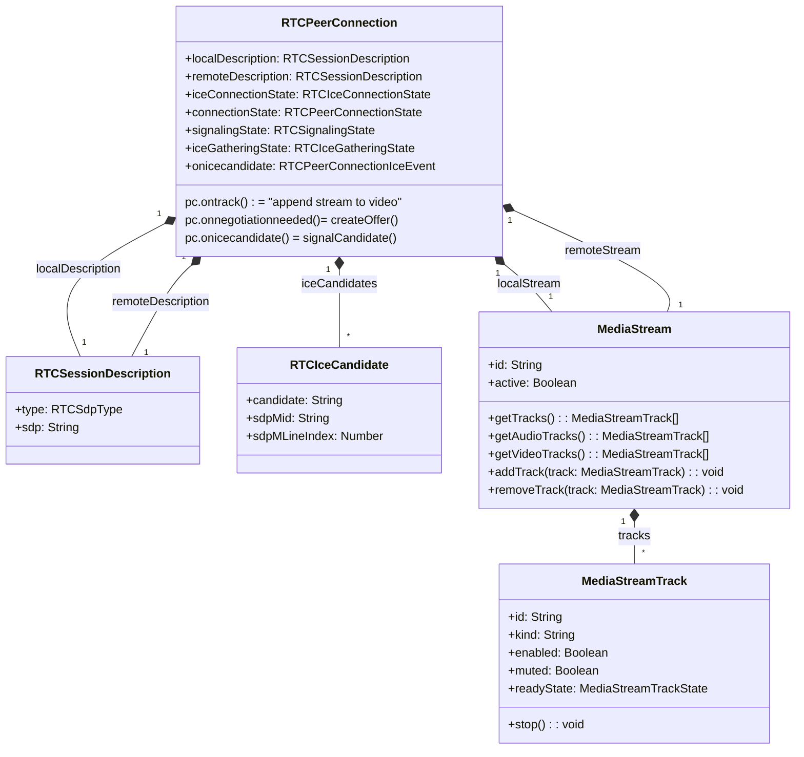
```mermaid
classDiagram
  class RTCPeerConnection {
    +localDescription: RTCSessionDescription
    +remoteDescription: RTCSessionDescription
    +iceConnectionState: RTCIceConnectionState
    +connectionState: RTCPeerConnectionState
    +signalingState: RTCSignalingState
    +iceGatheringState: RTCIceGatheringState
    +onicecandidate: RTCPeerConnectionIceEvent

    pc.ontrack() =  "append stream to video"
    pc.onnegotiationneeded()= createOffer()
    pc.onicecandidate() = signalCandidate()
  }

  class RTCSessionDescription {
    +type: RTCSdpType
    +sdp: String
  }

  class RTCIceCandidate {
    +candidate: String
    +sdpMid: String
    +sdpMLineIndex: Number
  }

  RTCPeerConnection "1" *-- "1" RTCSessionDescription : localDescription
  RTCPeerConnection "1" *-- "1" RTCSessionDescription : remoteDescription
  RTCPeerConnection "1" *-- "*" RTCIceCandidate : iceCandidates

  class MediaStream {
    +id: String
    +active: Boolean
    +getTracks(): MediaStreamTrack[]
    +getAudioTracks(): MediaStreamTrack[]
    +getVideoTracks(): MediaStreamTrack[]
    +addTrack(track: MediaStreamTrack): void
    +removeTrack(track: MediaStreamTrack): void
  }

  class MediaStreamTrack {
    +id: String
    +kind: String
    +enabled: Boolean
    +muted: Boolean
    +readyState: MediaStreamTrackState
    +stop(): void
  }

  RTCPeerConnection "1" *-- "1" MediaStream : localStream
  RTCPeerConnection "1" *-- "1" MediaStream : remoteStream
  MediaStream "1" *-- "*" MediaStreamTrack : tracks
```

</details>
<br/>

[:arrow_up:](#rtc---a-demo-of-webrtc-with-elixir)

## ExWebRTC

We will now use the package `ex_webrtc` that provides a server side solution written in Elixir.

We start with the "echo" demo: the ExWebRTC server sends back to the user his own video streams. It sends the video in SRTP packets using VP8, so the browser can play it.

### Using channels

#### The server WebRTC process

##### Signaling module

We will use `Elixir.Channel` for the signaling between the client and the server `ExWebRTC` processes. The message flow between the browser and the `ExWebRTC` process passes through a Channel. The LiveView process isn't involded.

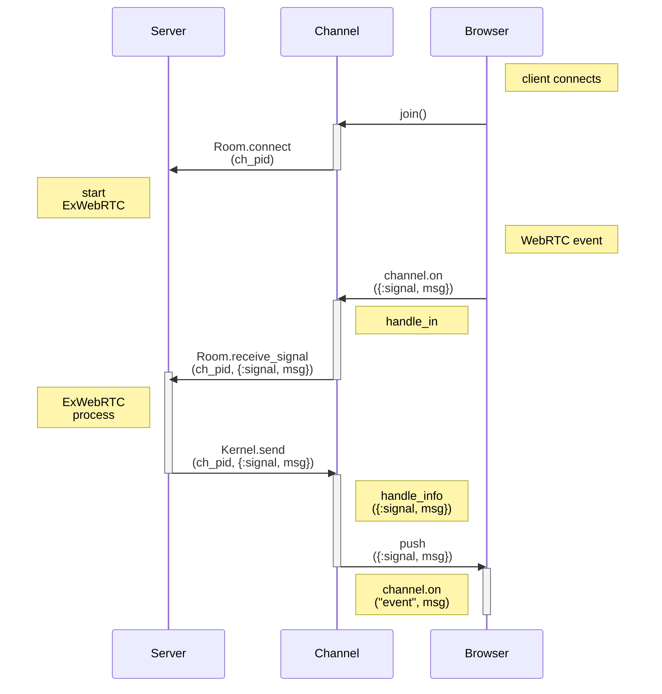
```mermaid
sequenceDiagram
  participant S as Server
  participant C as Channel
  participant B as Browser

  Note right of B: client connects
  B ->>C: join()
  activate C
  C ->> S: Room.connect <br> (ch_pid)
  deactivate C
  Note left of S: start <br>ExWebRTC

  Note right of B: WebRTC event
  B ->> C: channel.on<br>({:signal, msg})
  activate C
  Note right of C: handle_in
  C ->> S: Room.receive_signal<br>(ch_pid, {:signal, msg})
  activate S
  deactivate C
  Note left of S: ExWebRTC<br>process
  S ->> C: Kernel.send <br>(ch_pid, {:signal, msg})
  deactivate S
  activate C
  Note right of C: handle_info<br>({:signal, msg})
  C ->> B: push<br>({:signal, msg})
  deactivate C
  activate B
  Note left of B: channel.on<br>("event", msg)
  deactivate B
```

<br/>

In the "signaling_channel.ex" module, we add a `handle_info` that will receive the messages sent from the server to the channel pid. We use `push` since we send to the client on the same socket. The messages sent from the client are received in the `handle_in`: it calls server code, the GenServer that controls the Room.

```elixir
defmodule RtcWeb.SignalingChannel do
  use RtcWeb, :channel
  require Logger

  @impl true
  def join("room:" <> id = _room_id, payload, socket) do
    send(self(), {:after_join, id})
    {:ok, assign(socket, %{room_id: id, user_id: payload["userId"], users: []})}
  end

  @impl true
  def handle_info({:after_join, id}, socket) do
    # calls ExWebRTC.PeerConnection.start() on the server
    :connected = Rtc.Room.connect(id, self())
    {:noreply, socket}
  end

  @impl true
  def handle_info({:signaling, %{"type" => type} = msg}, socket) do
    :ok = push(socket, type, msg)
    {:noreply, socket}
  end

  @impl true
  def handle_in("signal", msg, socket) do
    Rtc.Room.receive_signaling_msg(socket.assigns.room_id, msg)
    {:noreply, socket}
  end
```

The "signalingChannel.js" remains the same.

[:arrow_up:](#rtc---demo-of-elixir-and-webrtc)

### RTC module

The "RTC.js" module is simplified. Change the reference in "app.js".

<details><summary>WebRTC hook to communicate with the server</summary>

```js
// /assets/js/serverRTC.js
import setPlayer from "./setPlayer.js";
import joinChannel from "./signalingChannel.js";

const RTC = {
  // global variables
  pc: null,
  channel: null,
  localStream: null,

  destroyed() {
    console.log("destroyed");
    if (this.localStream) {
      this.localStream.getTracks().forEach((track) => track.stop());
      this.localStream = null;
    }

    if (this.channel) {
      this.channel.leave().receive("ok", () => {
        console.log("left room, closing channel", this.channel.topic);
      });
      this.channel = null;
    }
    if (this.pc) {
      this.pc.close();
      this.pc = null;
    }
    window.pc = null;
  },

  async mounted() {
    const configuration = {
      iceServers: [{ urls: "stun:stun.l.google.com:19302" }],
    };

    const mediaConstraints = {
      video: {
        facingMode: "user",
        frameRate: { ideal: 15 },
        width: { ideal: 320 },
        height: { ideal: 160 },
      },
      audio: true,
    };

    let iceCandidatesQueue = [];

    const userId = document.querySelector("#room-view").dataset.userId;
    const roomId = window.location.pathname.slice(1).toString();

    let rtc = this;

    const handlers = {
      offer: async (msg) => {
        await rtc.pc.setRemoteDescription(msg.sdp);
        const answer = await rtc.pc.createAnswer();
        await rtc.pc.setLocalDescription(answer);

        rtc.channel.push("answer", {
          sdp: rtc.pc.localDescription,
          type: "answer",
          from: userId,
        });
      },
      answer: async (msg) => {
        await rtc.pc.setRemoteDescription(msg.sdp);
      },
      ice: async (msg) => {
        if (msg.candidate === null) {
          return;
        }
        await rtc.pc.addIceCandidate(msg.candidate);
      },
    };

    rtc.channel = await joinChannel(roomId, userId, handlers);
    rtc.pc = new RTCPeerConnection(configuration);

    const stream = await navigator.mediaDevices.getUserMedia(mediaConstraints);
    // to close the Media when the user leaves the room
    rtc.localStream = stream;
    setPlayer("local", stream);
    stream.getTracks().forEach((track) => rtc.pc.addTrack(track, stream));

    rtc.pc.onicecandidate = (event) => {
      if (event.candidate) {
        rtc.channel.push("ice", {
          candidate: event.candidate,
          type: "ice",
        });
      }
    };

    rtc.pc.ontrack = ({ streams }) => {
      setPlayer("remote", streams[0]);
    };

    rtc.pc.onconnectionstatechange = listenConnectionState;

    rtc.pc.onnegotiationneeded = async () => {
      const offer = await rtc.pc.createOffer();
      await rtc.pc.setLocalDescription(offer);
      rtc.channel.push("offer", { sdp: offer, type: "offer", from: userId });
    };

    function listenConnectionState() {
      const state = rtc.pc.connectionState;
      if (
        state === "disconnected" ||
        state === "failed" ||
        state === "closed"
      ) {
        rtc.destroyed();
      }
    }
  },
};

export default RTC;
```

</details>

[:arrow_up:](#rtc---demo-of-elixir-and-webrtc)

### Example of ExWebRTC with an Echo server

[Source: ExWebRTC Echo example](https://github.com/elixir-webrtc/ex_webrtc/tree/master/examples/echo/lib/echo)

When the user navigates to the Echo page, the Javascript hook will run. It will start a Channel which in turn will start an ExWebRTC PeerConnection server side. The hook will also instantiate a WebRTC connection with the ExWebRTC server. The signaling process will start.
The browser will display its own video, send it to the server who will echo it back and the browser will display it in another `<video>` element.

The key is to let the ExWebRTC server instance (named `pc` below) send back the packet received from the client - in a `handle_info(:rtp)` - under his own "server_track_id".

```elixir
PeerConnection.send_rtp(pc, server_track_id, client_packet)
```

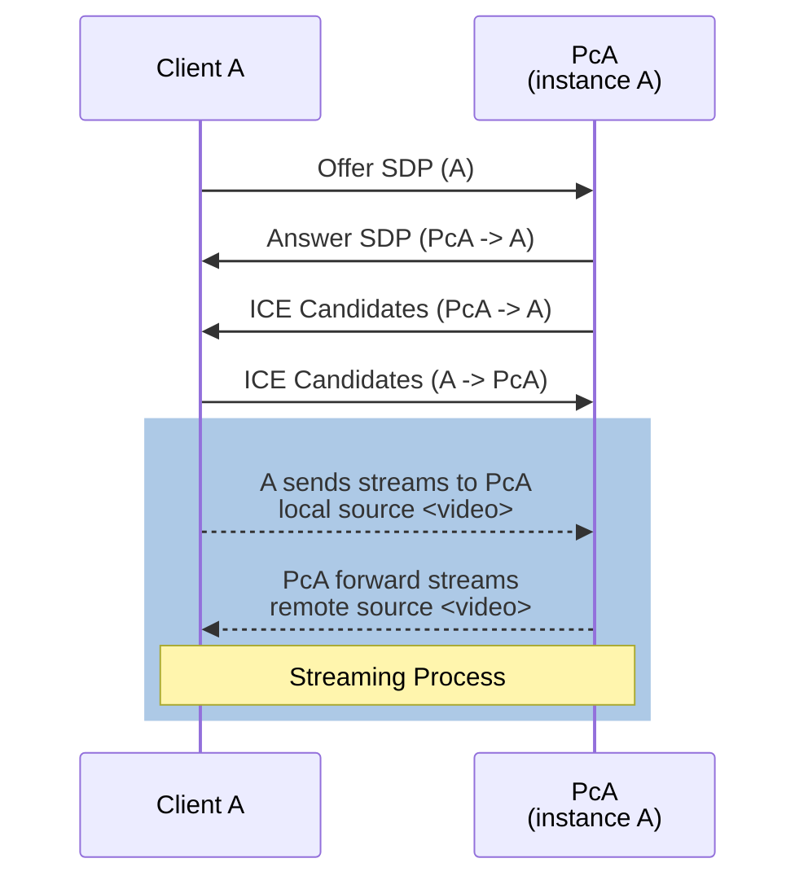
```mermaid
sequenceDiagram
    participant A as Client A
    participant PcA as PcA <br>(instance A)

    A->>PcA: Offer SDP (A)
    PcA->>A: Answer SDP (PcA -> A)
    PcA->>A: ICE Candidates (PcA -> A)
    A->>PcA: ICE Candidates (A -> PcA)


    rect rgb(173, 201, 230)
        A-->>PcA: A sends streams to PcA <br> local source <video>

        PcA-->>A: PcA forward streams <br> remote source <video>

        note over A,PcA: Streaming Process
    end
```

<details><summary>ExWebRTC Echo server</summary>

```elixir
defmodule RTC.Room do
  use GenServer, restart: :temporary

defp id(room_id), do:
  {:via, Registry, {Rtc.Reg, room_id}}
###

def start_link(room_id), do:
  GenServer.start_link(__MODULE__, room_id, name: id(room_id))

def connect(room_id, channel_pid), do:
  GenServer.call(id(room_id), {:connect, channel_pid})

def receive_signaling_msg(room_id, msg), do:
  GenServer.cast(id(room_id), {:receive_signaling_msg, msg})

#####
def init(room_id) do
  {:ok,
    %{
      room_id: room_id,
      pc: nil,
      pc_id: nil,
      channel: nil,
      client_video_track: nil,
      client_audio_track: nil
    }}
end

def handle_call({:connect, channel_pid}, _from, state) do

  Process.monitor(channel_pid)
  {:ok, pc} = PeerConnection.start_link(ice_servers: @ice_servers)

  state =
    state
    |> Map.put(:channel, channel_pid)
    |> Map.put(:pc, pc)

  vtrack = MediaStreamTrack.new(:video)
  atrack = MediaStreamTrack.new(:audio)
  {:ok, _sender} <- PeerConnection.add_track(pc, vtrack)
  {:ok, _sender} <- PeerConnection.add_track(pc, atrack)

  new_track =
    %{
      serv_video_track: vtrack,
      serv_audio_track: atrack
    }
  {:reply, :connected, Map.merge(state, new_track)}

end

#-- receive offer from client
def handle_cast({:receive_signaling_msg, %{"type" => "offer"} = msg}, state) do
    with desc <-
           SessionDescription.from_json(msg["sdp"]),
         :ok <-
           PeerConnection.set_remote_description(state.pc, desc),
         {:ok, answer} <-
           PeerConnection.create_answer(state.pc),
         :ok <-
           PeerConnection.set_local_description(state.pc, answer),
         :ok <-
           gather_candidates(state.pc) do
      Logger.debug("--> Server sends Answer to remote")

      #  the 'answer' is formatted into a struct, which can't be read by the JS client
      sent_answer = %{
        "type" => "answer",
        "sdp" => %{type: answer.type, sdp: answer.sdp},
        "from" => msg["from"]
      }

      send(state.channel, {:signaling, sent_answer})
      {:noreply, state}
    else
      error ->
        Logger.error("Server: Error creating answer: #{inspect(error)}")
        {:stop, :shutdown, state}
    end
  end

  # -- receive ICE Candidate from client
  def handle_cast({:receive_signaling_msg, %{"type" => "ice"} = msg}, state) do
    case msg["candidate"] do
      nil ->
        {:noreply, state}

      candidate ->
        candidate = ICECandidate.from_json(candidate)
        :ok = PeerConnection.add_ice_candidate(state.pc, candidate)
        Logger.debug("--> Server processes remote ICE")
        {:noreply, state}
    end
  end

#-- send ICE candidate to the client
def handle_info({:ex_webrtc, _pc, {:ice_candidate, candidate}}, state) do
  candidate = ICECandidate.to_json(candidate)
  send(state.channel, {:signaling, %{"type" => "ice", "candidate" => candidate}})
  {:noreply, state}
end

# receive the client track_id per kind and save it in the state
def handle_info({:ex_webrtc, _pc, {:track, %{kind: :audio} = track}}, state) do
    {:noreply, %{state | client_audio_track: track}}
  end

  def handle_info({:ex_webrtc, pc, {:track, %{kind: :video} = track}}, state) do
    {:noreply, %{state | client_video_track: track}}
  end

# the server receives packets from the client.
# We pick the packets with kind :audio by matching the received track_id with the
# state.client_audio_track.id.
# We send these packets to the PeerConnection under the server audio track id.

def handle_info(
        {:ex_webrtc, pc, {:rtp, c_id, packet}},
        %{client_audio_track: %{id: c_id, kind: :audio}} = state
      ) do
    PeerConnection.send_rtp(pc, state.serv_audio_track.id, packet)
    {:noreply, state}
  end

  def handle_info(
        {:ex_webrtc, pc, {:rtp, c_id, packet}},
        %{client_video_track: %{id: c_id, kind: :video}} = state
      ) do
    PeerConnection.send_rtp(pc, state.serv_video_track.id, packet)
    {:noreply, state}
  end
end
```

</details>
<br/>

### Example of ExWebRTC with two connected clients

Two clients A and B will connect to the server and will create their own PeerConnection on the server.

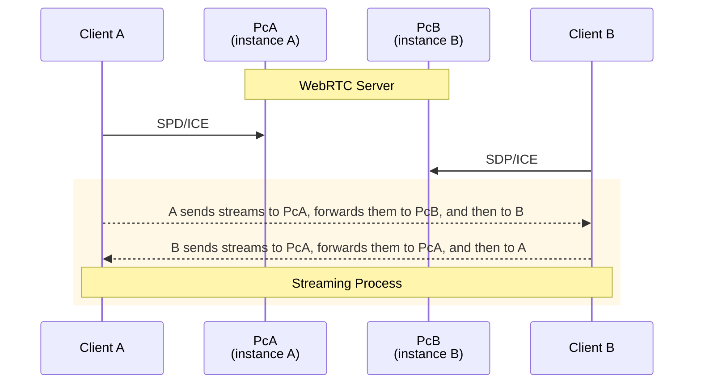
```mermaid
sequenceDiagram
    participant A as Client A
    participant PcA as PcA <br>(instance A)
    participant PcB as PcB <br>(instance B)
    participant B as Client B

    note over PcA, PcB: WebRTC Server

    A->>PcA: SPD/ICE

    B->>PcB: SDP/ICE

    rect rgb(255, 248, 230)
        A-->>B: A sends streams to PcA,  forwards them to PcB, and then to B

        B-->>A: B sends streams to PcA,  forwards them to PcA, and then to A
        note over A,B: Streaming Process
    end
```

<br/>

In a `handle_info(:rtp)`, for each type of track (video or audio), you must forward the packets received by a server PeerConnection process from his client to the other PeerConnection process.

In the handler below, the current `ExWebRTC.PeerConnection` will receive packets from his client (so the value of `pc_current` below will approximatively alternate between `pc1` and `pc2`, once both peers are connected to the Gateway.).

```elixir
def handle_info({:ex_webrtc, pc_current, {:rtp, id, packet}}, state)
```

You must look for the PID (say `pc2`) of the other `PeerConnection` process and forward the packets with `send_rtp`:

```elixir
PeerConnection.send_rtp(pc2, server_track_id, client_packet)
```

When the first peer connects, it produces a [keyframe](https://en.wikipedia.org/wiki/Intra-frame_coding), but there are no other peers, so the keyframe dropped. When the second peer connects, the first one does not know that it has to produce a new keyframe without using PLI, thus the long freeze. You must renew it with `send_pli`.

When the second peer `pc2` is connected, then you tell `pc1` to:

```elixir
PeerConnection.send_pli(pc1, pc1.client_v_track_id)
```

The dual streaming should now happen.

### Statistics and getting transfer rates with getStats

We can count the size of each packet we receive in the Room callback event "rtp" with `byte_size(packet)`.
WebRTC provides directly stats with the `peerConnection.getStats()` method.

> This data is also collected by the ExWebRTC dashboard.

> You can also visit the pages `chrome://webrtc-internals` for Chrome and `about:webrtc` for Firefox.

We can use it to display directly the transfer rate in the browser without keeping the server busy nor round trip.

<details><summary>Javascript snippet of the bitrate</summary>

```js
let init = 0,
  timeInt = 2_000;

async function logPacketSizes() {
  try {
    const stats = await rtc.pc.getStats();
    stats.forEach((report) => {
      if (report.type === "outbound-rtp" && report.kind === "video") {
        let bytesChange = report.bytesSent - init;
        init = report.bytesSent;
        let rate = Math.round((bytesChange * 8) / timeInt);

        document.querySelector("#stats").textContent =
          "Video transfer rate: " + rate + " kBps";
      }
    });
  } catch (error) {
    console.error("Error getting stats:", error);
  }
}

// use it in the WebRTC event listener:
function listenConnectionState() {
  const state = rtc.pc.connectionState;
  if (state === "connected") {
    rtc.int = setInterval(logPacketSizes, timeInt);
  }
}
```

</details>
<br/>

### Details of the process supervision

We use a Lobby GenServer to start dynamically supervised Room processes when a user enter a given room.
A Room process is a GenServer that starts a ExWebRTC PeerConnection with the client.
The client is connected via the LiveView for the HTML rendering, and the Channel (via the custom RoomSocket) for the signaling.

Each peer will create his own `ExWebRTC.PeerConnection` process.

We `Process.monitor` the Channel process from the Room process. When a client leaves the page, this stops the channel. The dynamic GenServer will consequently stop.
The Lobby monitors the dynamic supervisor, so the lobby will update its state.
In the state, we track the pid, the room number, and number of connected peers.

```elixir

# RoomLive.ex, handle_event("goto")
Lobby.create_room(room_id)
#=>
DynamicSupervisor.start_child(DynSup,{RoomServer, [id: room_id]})

# SignalingChannel.ex, join/3
:connect = Room.connect(room_id, self())
# Room.ex, connect/2
{:ok, pc} = PeerConnection.start_link(ice_servers: @ice_servers)
```

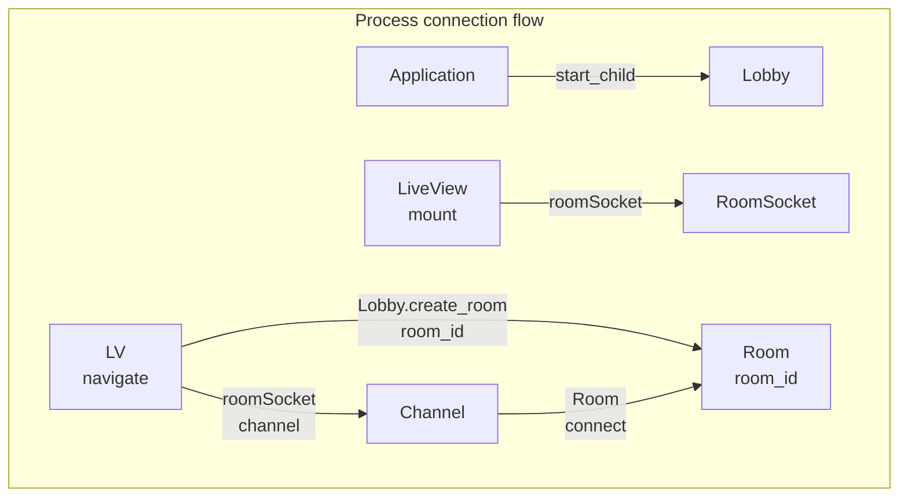
```mermaid
graph TB
    subgraph Process connection flow
    Application -- start_child --> L[Lobby]
    LVM[LiveView<br> mount] -- roomSocket --> RS[RoomSocket]
    LVN[LV <br>navigate] -- Lobby.create_room<br>room_id --> M[Room<br>room_id]
    LVN-- roomSocket<br>channel-->  Ch[Channel]
    Ch -- Room<br>connect --> M
    end
```

## HLS with an Elixir server

### What is HLS

[Source](https://obsproject.com/forum/resources/how-to-do-hls-streaming-in-obs-open-broadcast-studio.945/)

HLS stands for [HTTP Live Streaming](https://en.wikipedia.org/wiki/HTTP_Live_Streaming). The protocol is based on standard HTTP transactions.
It allows you to stream live on any website; the website does not require special streaming server software to be installed.

Alhough one of the key feature is **adaptative bitrate streaming**, we don't develop this here but focus on getting it working.

HLS was designed to enable big live sporting events to be streamed on content delivery networks, which only supported simple static file serving. It is also useful if you have a website on very simple cheap shared hosting and can't install a streaming server.

How does HLS work? The streamer breaks the video into lots of small segments, which are uploaded as separate files.
It also frequently updates a .m3u8 playlist file which contains information about the stream and the location of the last few segments. JavaScript in the viewer's web browser downloads the segments in turn and stitches them together to play back seemlessly. The web browser repeatedly downloads the .m3u8 file to discover new segments as they appear.

HTTP Live Streaming can traverse any firewall or proxy server that lets through standard HTTP traffic, unlike UDP-based protocols such as RTP. This also allows content to be offered from conventional HTTP servers and delivered over widely available HTTP-based CND (content delivery network). You have high latency (several seconds).

### The process

You have a producer of video streams and viewers of these streams. Both use the `video` HTMLElement of their browser.
The producer get streams from his webcam with `MediaDevices.getUserMedia`.
The streams are then trasnformed with `mediaRecorder` into a `Blob` of type **webm** (VP8 /VP9 encoding).
Since we want to send data to the LiveView backend via the LiveSocket, we need to build Base 64 encoded strings.
The Bas64 codec uses the `FileReader` for this. This data-url is then `Phoenix.LiveView.push` to the backend.
This is a continous process with a time interval of 1s (arbitrary).

The backend receives the event with the data. It decodes from Base64 back and sends the binary to an FFmpeg process.
This OS process is launched with `Porcelain`. Since the browser emits data regularly, we feed the OS stdin with the data and FFmpeg receives them as a buffer.
FFmpeg transcodes the data from (webm) VP8/VP9 **into H.264/H.265 (MPEG)**. It produces 2 type of files: a manifest which is an index of files, and segments which contains the video chunks. HLS will also create duplicates at different quality levels.

These files are kept on the filsystem and Phoenix will serve them as static files.

The incoming data chunks are managed with a **queue** (using Erlang's `:queue`). This provides a backpressure mechanism to prevent the FFmpeg buffer from being overwhelmed by possibly too many chunks.

A viewer connects to the app. On connection, he loads the library `hls.js`. It will continuously look for updates of the manifest file and fetch the corresponding segments. These segments are the input of his `video` HTMLElement.

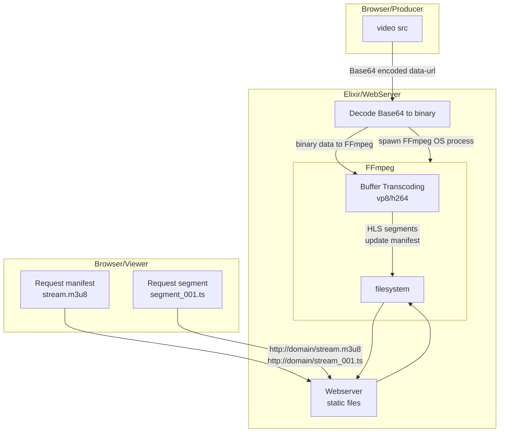
```mermaid
graph TD
    subgraph Browser/Producer
      A0[video src]
    end

     A0 -- Base64 encoded data-url --> B1

    subgraph Elixir/WebServer
        B1[Decode Base64 to binary]
        B2[Webserver <br> static files]
        B1 -- spawn FFmpeg OS process--> FFmpeg
        B1 -- binary data to FFmpeg --> B3
        subgraph FFmpeg
          B3[Buffer Transcoding <br> vp8/h264]
          B3 -- HLS segments <br> update manifest --> B4[filesystem]
        end
        B2 --> B4
        B4 --> B2
    end


    subgraph Browser/Viewer
        C1[Request manifest <br> stream.m3u8]  --> B2
        C2[Request segment <br> segment_001.ts] -- http://domain/stream.m3u8 <br>http://domain/stream_001.ts --> B2
    end
```

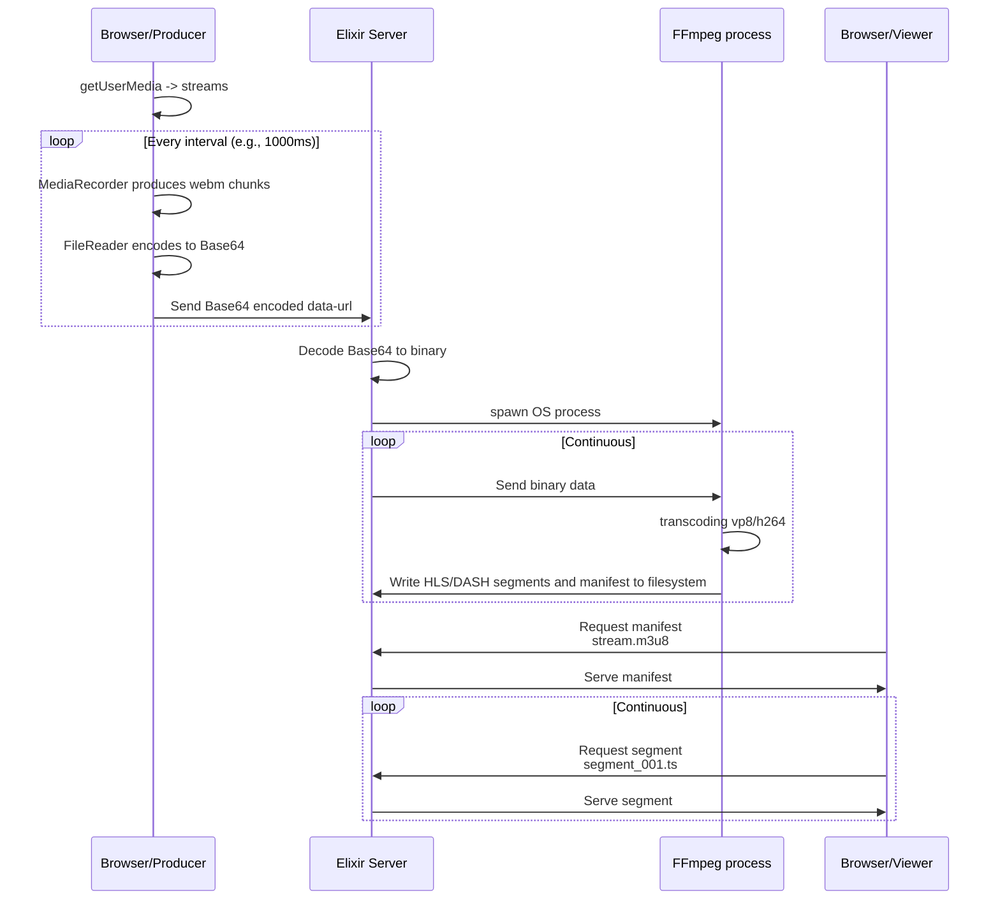
```mermaid
sequenceDiagram
    participant Browser/Producer
    participant Elixir Server
    participant FFmpeg process
    participant Browser/Viewer

    Browser/Producer->>Browser/Producer: getUserMedia -> streams
    loop Every interval (e.g., 1000ms)
        Browser/Producer->>Browser/Producer: MediaRecorder produces webm chunks
        Browser/Producer->>Browser/Producer: FileReader encodes to Base64
        Browser/Producer->>Elixir Server: Send Base64 encoded data-url
    end
    Elixir Server->>Elixir Server: Decode Base64 to binary
    Elixir Server->>FFmpeg process: spawn OS process
    loop Continuous
        Elixir Server->>FFmpeg process: Send binary data
        FFmpeg process ->>FFmpeg process: transcoding vp8/h264
        FFmpeg process->>Elixir Server: Write HLS/DASH segments and manifest to filesystem
    end
    Browser/Viewer->>Elixir Server: Request manifest <br>stream.m3u8
    Elixir Server->>Browser/Viewer: Serve manifest
    loop Continuous
        Browser/Viewer->>Elixir Server: Request segment <br> segment_001.ts
        Elixir Server->>Browser/Viewer: Serve segment
    end

```

### FileWatcher on the manifest file

```txt
#EXTM3U
#EXT-X-VERSION:3
#EXT-X-TARGETDURATION:8
#EXT-X-MEDIA-SEQUENCE:0
#EXT-X-PLAYLIST-TYPE:EVENT
#EXTINF:8.356544,
segment_000.ts
#EXTINF:8.356544,
segment_001.ts
#EXTINF:8.356544,
segment_002.ts
#EXTINF:0.467911,
segment_003.ts
#EXT-X-ENDLIST
```

- EXTM3U: this indicates that the file is an extended m3u file. Every HLS playlist must start with this tag.
- EXT-X-VERSION: indicates the compatibility version of the Playlist file.
- EXT-X-TARGETDURATION: this specifies the maximum duration of the media file in seconds.
- EXT-X-MEDIA-SEQUENCE: indicates the sequence number of the first URL that appears in a playlist file. Each media file URL in a playlist has a unique integer sequence number. The sequence number of a URL is higher by 1 than the sequence number of the URL that preceded it. The media sequence numbers have no relation to the names of the files.
- EXTINF: tag specifies the duration of a media segment. It should be followed by the URI of the associated media segment — this is mandatory. You should ensure that the EXTINF value is less than or equal to the actual duration of the media file that it is referring to

### Proxy or CDN

Naturally, we can opt to use a dedicated Webserver - Nginx, Apache or Caddy - instead of Phoenix to server these files.

Wwe can also use a CDN. Instead of saving files, we can use the output streams of Ffmpeg and send them to a CDN.
Once we get a 201 back, we can forward the URL to the client.

## MPEG-DASH with an Elixir server

The process is totally similar to the HLS, except from the FFmpeg command and the Javascript library that handles the streams.

## Basics on Channel and Presence

### Refresher (or not) on Erlang queue

We use 2 times a `:queue`. USed [this source](https://blog.jola.dev/erlang-queue-module-elixir).
In resume, it is a FIFO, with `:queue.new`, `:queue.in` and `:queue.out`.

<details>
<summary>Examples of ":queue" commands </summary>

```elixir
iex(38)> q = :queue.new()
{[], []}
iex(33)> q = :queue.in("a", q)
{["a"], []}
iex(34)> q = :queue.in("b", q)
{["b"], ["a"]}
iex(35)> q = :queue.in("c", q)
{["c", "b"], ["a"]}

iex(36)> {{:value, value3}, q} = :queue.out(q)
{{:value, "a"}, {["c"], ["b"]}}
iex(37)> {{:value, value2}, q} = :queue.out(q)
{{:value, "b"}, {[], ["c"]}}
iex(37)> {{:value, value3}, q} = :queue.out(q)
{{:value, "c"}, {[], []}}

iex(39)> :queue.out(q)
{:empty, {[], []}}
```

</details>
<br/>

### Refresher on Channels, Custom sockets, Presence

We include a step-by-step reminder on Channels and Presence if you don't use this every day.

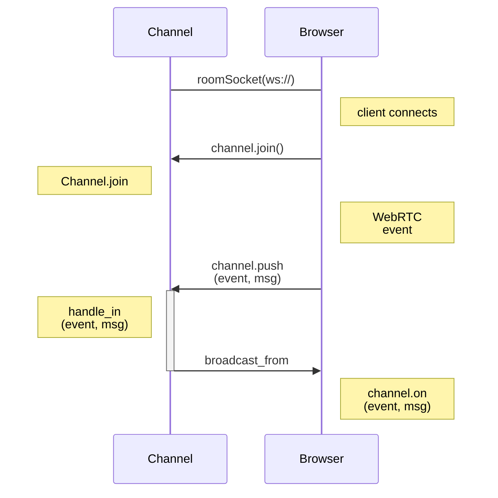
```mermaid
sequenceDiagram
  participant Channel
  participant Browser

  Channel -> Browser: roomSocket(ws://)
  Note right of Browser: client connects
  Browser ->> Channel: channel.join()
  Note left of Channel: Channel.join
  Note right of Browser: WebRTC <br>event
  Browser ->> Channel: channel.push<br>(event, msg)
  activate Channel
  Note left of Channel: handle_in<br>(event, msg)
  Channel ->> Browser: broadcast_from
  deactivate Channel
  Note right of Browser: channel.on<br>(event, msg)
```

### Custom WebSocket connection

We will generate a custom WebSocket connection named `RoomSocket` that will support all the Channel `SignalingChannel` processes that are appended to this WS when you enter a "room".

We name-space with "/room":

```bash
ws://localhost:4000/room/websocket?user_token=XYZ...
```

#### Client-side

The primitives come from [PhoenixJS](https://hexdocs.pm/phoenix/js/index.html#phoenix). This package is imported into our app.

We create a client module "roomSocket.js" that exports a `roomSocket` object. We append a "user_token" to the query string. It will be created by the server and passed to Javascript as an assign.

<details>
  <summary>"roomSocket.js" </summary>

```js
// /assets.js/roomSocket.js
import { Socket } from "phoenix";

export defaut new Socket("/room", {
  params: { user_token: window.userToken },
});
```

</details>

<br/>

The usage of the `window.userToken` is explained [below](#ws-security).

To instantiate the WS, import it into the main "app.js" file and invoque the `connect` method as below:

```js
// /assets/js/app.js
import roomSocket from "./roomSocket.js";
[...]
roomSocket.connect();
```

#### Server-side

We finish this WebSocket connection server-side with two files: the endpoint and the module `RtcWeb.RoomSocket` it references.

> The URI should match the one defined client-side.

<details>
  <summary>Server Endpoint of the WS "room_socket"</summary>

```elixir
#/lib/rtc_web/endpoint.ex
socket "/room", RtcWeb.RoomSocket,
  websocket: true,
  longpoll: false
```

</details>
<br/>

and the server module declared above:.

<details>
<summary>RoomSocket module</summary>

```elixir
defmodule RtcWeb.RoomSocket do
  use Phoenix.Socket

  @impl true
  def connect(%{"user_token" => user_token} = _params, socket, _connect_info) do
    case Phoenix.Token.verify(WebRtcWeb.Endpoint, "user token", user_token) do
      {:ok, _} ->
        {:ok, socket}

      {:error, reason} ->
        {:error, %{reason: reason}}
    end
  end

  @impl true
  def id(_socket), do: nil
end
```

</details>
<br/>

> In the `connect` callback, we verify that the token is valid (we used `Phoenix.Token` to generate it). The next paragraph explains more about this.

### WS Security

We follow the [documentation](https://hexdocs.pm/phoenix/channels.html#using-token-authentication).

- We create the "user_token" to authenticate the custom WebSocket connection.
  We use the built-in module `Phoenix.Token` for this.
- We create it in the `Router.ex` module with a `Plug`.
- We pass it to the assigns so it is available in "root.html.heex" or "app.html.heex".
- We pass it as a script, and Javascript will append it to the `window` object: any Javascript code will access it.
- We now can use the `window.userToken` when the browser initiates the WebSocket "RoomSocket" connection. We pass the "user_token" in the query string of the WebSocket conection.

<details>
  <summary>Protect WS "socket" with a "user token" in Router</summary>

```elixir
# /lib/rtc_web/router.ex

pipeline :browser do
  ...
  plug :put_user_token
end

def put_user_token(conn, _) do
  # dummay user_id
  user_id = System.unique_integer() |> abs() |> Integer.to_string()

  user_token =
    Phoenix.Token.sign(WebRtcWeb.Endpoint, "user token", user_id)

  conn
  |> Plug.Conn.fetch_session()
  |> Plug.Conn.put_session(:user_id, user_id)
  |> Plug.Conn.assign(:user_token, user_token)
end
```

</details>
<br/>

<details>
  <summary>Pass the "user token" to Javascript</summary>

```html
lib/rtc_web/templates/layout/root.html.heex
<script>
  window.userToken = "<%= assigns[:user_token] %>";
</script>
```

</details>
<br/>

<br/>

When we run the server, we check that our custom socket is connected.

```bash
[info] CONNECTED TO RtcWeb.RoomSocket in 488µs
  Transport: :websocket
  Serializer: Phoenix.Socket.V2.JSONSerializer
  Parameters: %{"user_token" => "SFMyNTY.g2gDYW5uBgCcg3OLjwFiAAFRgA.0DV24hmkHsyemH-roK3o87ZGVgNoSWuss4YPC9bg6m4", "vsn" => "2.0.0"}
```

### Channel set up

The channels processes work with pattern matching. In the `RtcWeb.RoomSocket` module, we firstly declare the pattern(s) we use and the linked server module `RtcWeb.SignalingChannel`:

<details>
<summary>The RoomSocket module</summary>

```elixir
defmodule RtcWeb.RoomSocket do
  use Phoenix.Socket
  channel "room:*", RtcWeb.SignalingChannel
  ...
```

</details>
<br/>

The Channel has two parts, client and server.

On the client-side, we will append a channel to our custom socket, and on the server-side, we create a new module `SignalingChannel`.

We create a Javascript module to instantiate the channels (file named "signalingChannel.js").

<details>
<summary>Client-side signaling channel</summary>

```js
// /assets/signalingChannel.js
import roomSocket from "./roomSocket";

function joinChannel(roomId) {
  const channel = roomSocket.channel("room:" + roomId, {});

  channel
    .join()
    .receive("ok", (roomId) =>
      console.log(`Joined successfully room:${roomId}`)
    )
    .receive("error", (resp) => {
      console.log("Unable to join", resp);
      window.location.href = "/";
    });
}

joinChannel("lobby");
```

We import it into "app.js" to run this code.

```js
// apps.js
import "./signalingChannel";
```

</details>
<br/>

Server-side, the SignalingChannel module includes the `join` alter ego callback.

<details>
<summary>Server SignalingChannel module</summary>

```elixir
defmodule RtcWeb.SignalingChannel do
  use RtcWeb, :channel

  @impl true
  def join("room:" <> id, payload, socket) do
    {:ok, socket}
  end

  def id(_), do: nil
end
```

</details>
<br/>

We can check and run `mix phx.server`.
We should get the message below in the terminal:

```bash
[info] JOINED room:lobby in 228µs
  Parameters: %{}
```

and the message below in the console:

```js
Joined successfully
```

### Logs and local testing

#### Server logs

We can display the server logs in the browser with `web_console_logger: true` enabled in the "config/dev.exs" file and when you append the JS snippet below in "app.js",

```js
window.addEventListener("phx:live_reload:attached", ({ detail: reloader }) => {
  reloader.enableServerLogs();
});
```

You will see:

```js
// console logs
Joined successfully

// server logs
[info] CONNECTED TO RtcWeb.RoomSocket in 3ms  Transport: :websocket  Serializer: Phoenix.Socket.V2.JSONSerializer  Parameters: %{"user_token" => "SFMyNTY.g2gDYgAAARBuBgBsfdSLjwFiAAFRgA.YaxhoOEx_sZvmEVMnbg54labKwydi7XJKpYJ8Ksl1s4", "vsn" => "2.0.0"}
room_channels.js:8 Joined successfully

[info] JOINED room:lobby in 88µs  Parameters: %{}
```

#### Testing on local network

We follow the [documention](https://hexdocs.pm/phoenix/using_ssl.html#ssl-in-development).

Except your localhost, WebRTC requires HTTPS.
In order to test with a device (your phone or another computer) connected to the same network (such as the WIFI), you need to provide an HTTPS endpoint.
You can use a _self-signed certificate_ that can be generated by running the following Mix task:

```elixir
mix phx.gen.cert
```

This adds two files in the "/priv" folder.

Then, change the "/config/devs.exs" script to:

```elixir
# /config/dev.exs

config :rtc, RtcWeb.Endpoint,
  # Binding to loopback ipv4 address prevents access from other machines.
  # Change to `ip: {0, 0, 0, 0}` to allow access from other machines.
  http: [ip: {0, 0, 0, 0}, port: 4000],
               ^^^
  ...,
  # NEW: add SSL Support in devs mode for mobile
  https: [
    port: 4001,
    cipher_suite: :strong,
    keyfile: "priv/cert/selfsigned_key.pem",
    certfile: "priv/cert/selfsigned.pem"
  ]
```

Your server provides two endpoints, HTTP on port 4000, and HTTPS on port 4001. This is enough to run your tests.
You can also [ngrok](https://ngrok.com/) your HTTPS endpoint for remote testing.

### LiveView navigation

We render the HTML via `LiveView`.

All our routes will be under the same `live_session`.

Each route calls the module RoomLive. We append the "live_action" as an atom to each route.
This is passed into the socket assigns so we can handle different actions in the same Liveview and render the corresponding HTML.

:heavy_exclamation_mark: For Presence to detect the change of location of a user, you cannot use `patch`but only `navigate`.

> Recall that you get the params in the first argument of the LiveView `mount/3` and in the `handle_params` callback, callback before a `handle_event` if any (for example when you submit a form).

<details>
  <summary>The Router.ex module</summary>

```elixir
# /lib/rtc_web/router.ex
scope "/", RtcWeb do
  pipe_through :browser

  live_session :default do
    live "/", RoomLive, :lobby
    # room that uses ExWebRTC
    live "/ex/:room_id", RoomLive, :room
    # room that uses WebRTC
    live "/web/:room_id", RoomLive, :web
  end
end
```

</details>
<br/>

We used tabs, for the fun but also for the UI. It is _shamelessly borrowed_ from the excellent - because simple - solution from [Tracey Onim](h.ttps://medium.com/@traceyonim22/how-to-create-tabs-in-phoenix-liveview-caf960b7c517).

[:arrow_up:](#rtc---a-demo-of-webrtc-with-elixir)

### Presence

Source: <https://hexdocs.pm/phoenix/presence.html#usage-with-liveview>

:bangbang: Use `navigate`.

#### Set up

We firstly run the generator to generate a `RtcWeb.Presence` _client process_ that we start in the `Application.ex` module.

```bash
mix phx.gen.presence Presence
```

<details><summary>Start and supervise the Presence process</summary>

```elixir
# /lib/rtc/Application.ex
children = [
  ...
  RtcWeb.Presence,
  ...
]
```

</details>
<br/>

We track users per room with `Presence` as an [_Elixir client process_](https://hexdocs.pm/phoenix/Phoenix.Presence.html#module-using-elixir-as-a-presence-client), defined in the `Rtc.Presence` module.

When a user connects to the app, he is (pre)registered with a unique _user_id_.

Our Presence client module defines the following functions:

- `track_user` : used to start the `user_id` in the LiveView `mount`,
- `list_users`: the Presence process keeps the state and we access it with `Presence.list`. It outputs the list of users with meta-data (the room he attends),
- the `init` and `fetch` and `handle_metas` callbacks. When `Presence` detects a change, the `handle_metas` callback runs.
  This callback uses the `fetch` callback. We re-wrote the `fetch` callback to insert a mandatory `id` key since we are using streams. Note that you _need_ to add the `metas` key.

```elixir
def fetch(_topic, presences) do
  for {tracking_key, %{metas: metas}} <- presences, into: %{} do
    {tracking_key, %{metas: metas, id: tracking_key}}
  end
end
```

We then broadcast a `:join` or/and `:leave` event.

<details><summary>Presence tracking module</summary>

```elixir
defmodule RtcWeb.Presence do
  use Phoenix.Presence,
    otp_app: :rtc,
    pubsub_server: Rtc.PubSub

  require Logger

  def track_user(key, params) do
    Logger.info("Track #{key} with params #{inspect(params)}")
    track(self(), "proxy:users", key, params)
  end

  def list_users do
    RtcWeb.Presence.list( "proxy:users")
    |> Enum.map(fn {_room_id, presence} -> presence end)
  end

  @doc """
  We overwrite the callback to add the mandatory "id" key.
  We set its value to "tracking_key", which is the user_id
  """
  @impl true
  def fetch(_topic, presences) do
    for {tracking_key, %{metas: metas}} <- presences, into: %{} do
      {tracking_key, %{metas: metas, id: tracking_key}}
    end
  end

  @impl true
  def init(_opts) do
    Logger.info("Presence process: #{inspect(self())}")
    {:ok, %{pid: self()}}
  end

  @impl true
  def handle_metas(topic, %{leaves: leaves, joins: joins}, _presences, state) do
    for {_user_id, presence} <- joins do
      :ok =
        Phoenix.PubSub.local_broadcast(
          Rtc.PubSub,
          topic,
          {:join, presence}
        )
    end

    for {_user_id, presence} <- leaves do
      :ok =
        Phoenix.PubSub.local_broadcast(
          Rtc.PubSub,
          topic,
          {:leave, presence}
        )
    end

    {:ok, state}
  end
end
```

</details>
<br/>

#### Stream Presence

We use `streams` because their handling and rendering is easy.
Changes in the users' list will be pushed into the DOM - like delivering ephemeral messages - and no state is kept in the socket in a delcarative way: `stream_insert` or `stream_delete` upon Presence changes.

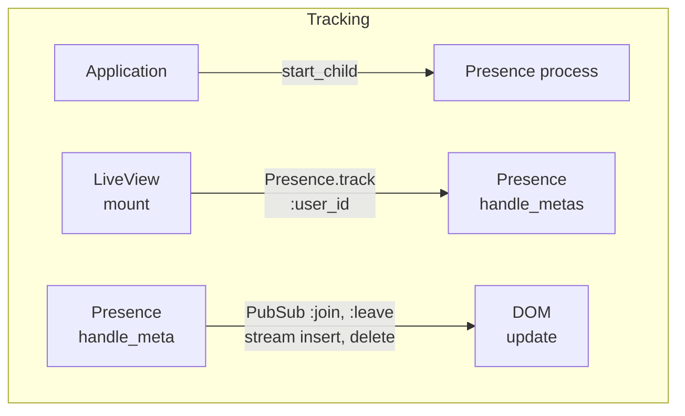
```mermaid
graph TB
    subgraph Tracking
    Application -- start_child --> P[Presence process]
    LVM[LiveView <br>mount] -- Presence.track<br>:user_id --> M[Presence <br> handle_metas]

    B[Presence <br> handle_meta] -- PubSub :join, :leave<br> stream insert, delete --> LV[DOM <br> update]
    end
```

We define a `stream` in the Liveview assigns and call the tracking in the `mount` callback.

<details><summary>Mount with Presence and streams</summary>

```elixir
defmodule Rtc.RoomLive do

  alias Rtc.Presence

  def mount(_params, session, socket) do
  user_id = session["user_id"]
    room_id = Map.get(params, "room_id", "lobby")
    room = "room:#{room_id}"

    socket =
      socket
      |> stream(:presences, Presence.list_users())
      |> assign(%{
        form: to_form(%{"room_id" => room_id}),
        min: 1,
        max: 20,
        room_id: room_id,
        user_id: user_id,
        room: room,
        id: socket.id
      })

    socket =
      if connected?(socket) do
        Logger.info("LV connected --------#{socket.id}")
        # we subscribe to a specific topic for the broadcasting of join & leave data
        subscribe("proxy:users")
        # you need to use the key ":id"
        Presence.track_user(user_id, %{
          id: room_id,
          user_id: user_id
        })
      end

    {:ok, socket}
  end

  end
end
```

</details>
<br/>

The Presence process sends a "presence_diff" event that we have to handle (although we don't use it here).
However, we handle the broadcasted `:leave` and `:join` messages to update the stream accordingly.

<details><summary>Presence handlers</summary>

```elixir
# mandatory callback from RoomChannel "handle_metas"
@impl true
def handle_info(%{topic: "proxy:users", event: "presence_diff"}, socket) do
  {:noreply, socket}
end
# PubSub callbacks
def handle_info({:join, user_data}, socket) do
  {:noreply, stream_insert(socket, :presences, user_data)}
end

def handle_info({:leave, user_data}, socket) do
  {:noreply, stream_delete(socket, :presences, user_data)}
end
```

</details>
<br/>

You can test this. Open 2 tabs:

```elixir
> iex -S mix phx.server
iex> RtcWeb.Presence.list_users()
[
  %{
    id: "576460752303421752",
    metas: [
      %{id: "lobby", user_id: "576460752303421752", phx_ref: "F9Cnz01URefvugbk"}
    ]
  },
  %{
    id: "576460752303421976",
    metas: [
      %{id: "lobby", user_id: "576460752303421976", phx_ref: "F9CnpfAVzmTvugaE"}
    ]
  }
]
```

and navigate each tab to say a different room:

```elixir
iex(2)> RtcWeb.Presence.list_users
[
  %{
    id: "576460752303421752",
    metas: [
      %{id: "2", user_id: "576460752303421752", phx_ref: "F9Cn0eXljnXvugEl"}
    ]
  },
  %{
    id: "576460752303421976",
    metas: [
      %{id: "1", user_id: "576460752303421976", phx_ref: "F9CnpfAVzmTvugaE"}
    ]
  }
]
```

It remains to render the users per room on the screen. We have to follow the rules by adding a `phx-udpate="stream"` and use an `id` exactly on the dom element we will interact on.
We define a rendering component where the list of users in a room is presented in a table.

<details><summary>Render list users per room</summary>

```elixir
defmodule UsersInRoom do
  use Phoenix.Component

  attr :room, :string
  attr :room_id, :integer
  attr :streams, :any

  def list(assigns) do
    ~H"""
    <h2>Users in <%= @room %></h2>
    <br />
    <table>
      <tbody phx-update="stream" id="room">
        <tr
          :for={{dom_id, %{metas: [%{id: id, user_id: user_id}]} = _metas} <- @streams.presences}
          id={dom_id}
        >
          <td :if={@room_id == id}>
            <%= user_id %>
          </td>
        </tr>
      </tbody>
    </table>
    """
  end
end
```

</details>
<br/>

and we declare this component in the `render` callbacks of our LiveView as:

```elixir
<UsersInRoom.list streams={@streams} room={@room} room_id={@room_id} />
```


#### A word on "hooks"

We use `LiveView`. The custom WebRTC Javascript code is encapsulated in a so-called "hook": it allows you to run custom Javascript code. The "hook" object has a complete lifecycle, such as `mounted` and `destroyed` for the "beforeunload" event. It is also equipped with LiveView primitives (cf [phoenix_live_view](https://www.npmjs.com/package/phoenix_live_view)).

It is linked to a DOM element - a DOM id is required - and called when this DOM element is rendered. In our case, this happens when we navigate to a given room page.

> In particular, we can use LiveView's primitives such as `pushEvent` and `handleEvent` to communicate with the LiveView (cf [doc](https://hexdocs.pm/phoenix_live_view/1.0.0-rc.0/Phoenix.LiveView.html#push_event/3)). It will use the `LiveSocket` to push messages into it so the RoomLive will receive them.

This is how we declare it:

```elixir
def render(assigns) when assigns.live_action == :room do
  ...
  <section id="room-view" phx-hook="rtc">
           ^^              ^^
```

We import the file "RTC.js" in the "app.js" module and append it to the `LiveSocket` to the `hooks` object. The key is the name declared in the HTML, and the value is the function name exported by the module. For example:

```js
// /assets/js/RTC.js
const RTC =  {
  mounted(){
    ...
  },
  destroyed(){
    ...
  }
}
export default RTC;


// /assets/js/app.js
import RTC from "./RTC.js"
[...]
let liveSocket = new LiveSocket("/live", Socket, {
  longPollFallbackMs: 2500,
  params: {_csrf_token: csrfToken},
  hooks: {rtc: RTC}
             ^^^
})

liveSocket.connect()
```

[:arrow_up:](#rtc---demo-of-elixir-and-webrtc)
