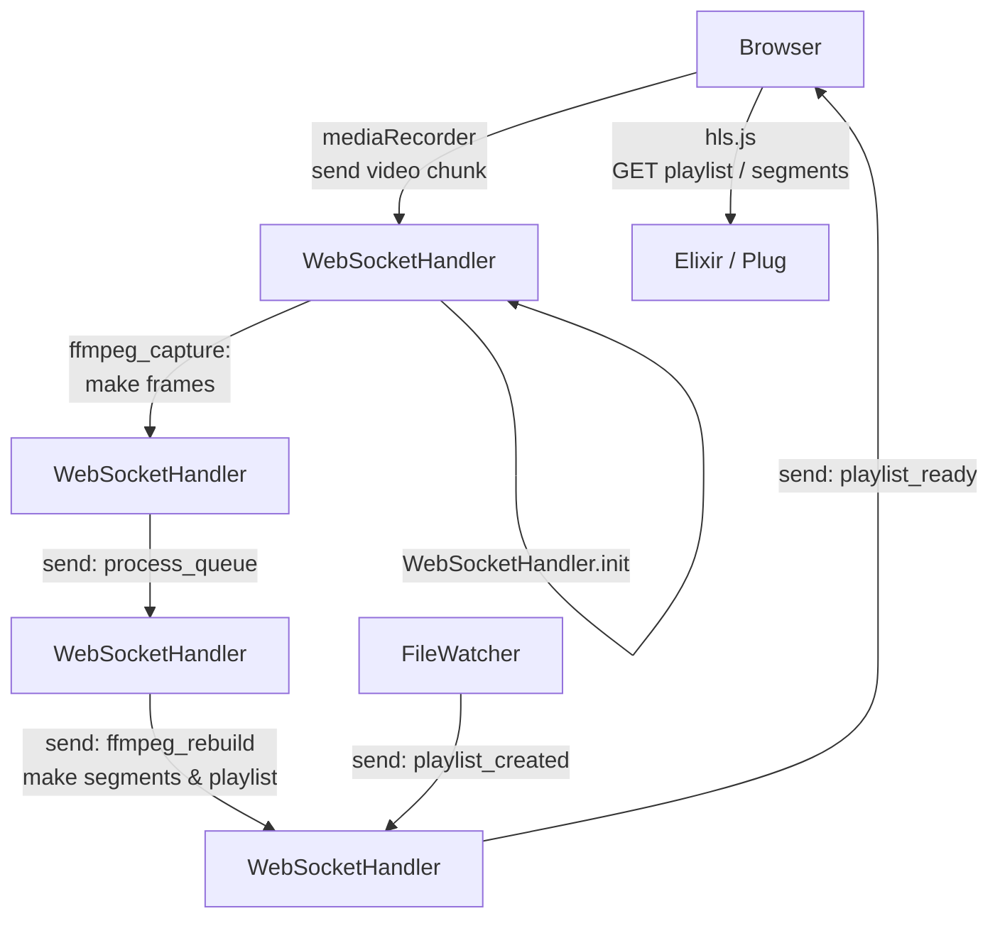
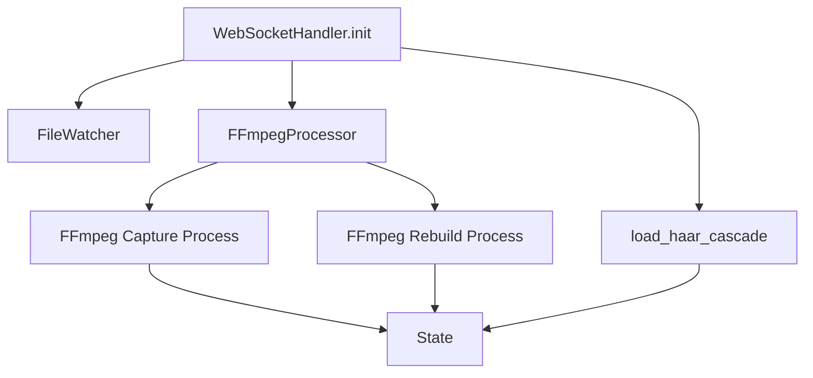
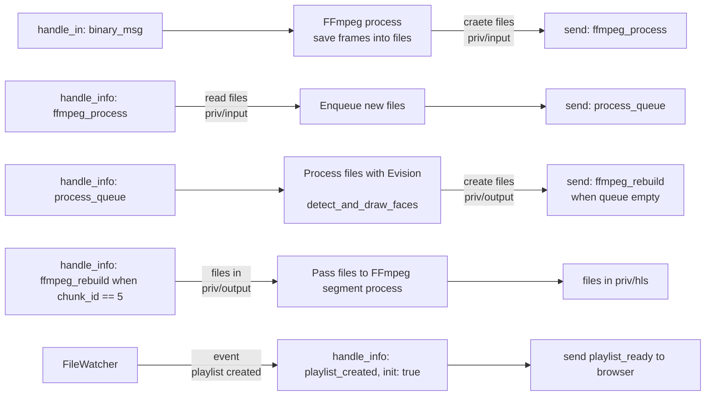
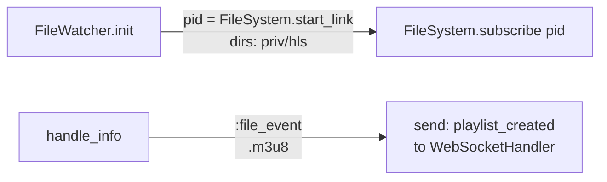

# HLS Mediasource with Elixir

## What?

This is a `Plug` app which aims to be minimal. It illustrates HTTP Live Streaming - <mark>[HLS](https://github.com/video-dev/hls.js)</mark>.

`HLS` is a streaming protocol developed by Apple to deliver media content over the internet using HTTP. It breaks the overall stream into a sequence of small HTTP-based file downloads, each download loading one short chunk of an overall potentially unbounded transport stream. It uses a (unique) "playlist" file that describes the "segments" files to be played. It uses a dedicated library Once these files are available for reading (in the browser), the library <mark>`hls.js`</mark> will download the playlist and consequently segments to be played. It handles entirely the playback process. `Elixir` will serve these files.

:exclamation: This protocole has **high latency**: you will experience up to 20 seconds delay.

Our job here is to:

- capture the built-in webcam stream
- transform the images server-side. We ran the "hello world" of computer vision, namely **face detection** with the `Haar Cascade model`. This is powered by [Evision](https://github.com/cocoa-xu/evision) (<mark>[OpenCV](https://docs.opencv.org/4.10.0/)</mark>). The model is present by default in the source code of `Evision` and has a loader for it.
- send the transformed images back to the browser. They are played back by the Javacript library `hls.js`. It is based on the [MediaSource API](https://developer.mozilla.org/en-US/docs/Web/API/MediaSource).

This relies heavily on <mark>[FFmpeg](https://ffmpeg.org/ffmpeg-formats.html#hls-1)</mark> to get frames from the input video source and build HLS segments and the playlist.

## How?

We run a tpc listener on port 4000 with `Bandit` to communicate with the browser.

We use a _raw WebSocket_ in the browser with the backend [websock_adapter](https://github.com/phoenixframework/websock_adapter). We use it to send binary data (an `ArryBuffer`) from the browser to the Elixir backend. Check [this blog](https://kobrakai.de/kolumne/bare-websockets).

We have a `Plug` router that:

- serves the static files: the (unique) HTML page, the associated Javascript module and the HLS files,
- handles the `WebSocket` connection.

We run `FFmpeg` as **"kept alive"** with `ExCmd.Process`. This is crucial for the process.

We run a **file watcher process** with `file_system`. It will detect when `FFmpeg` will have built the HLS playlist and segments.

## Run this

cd

### Mix

From this directory, do:

```elixir
open http://localhost:4000 && mix run --no-halt
```

> this uses `FFmpeg` but also `FileSystem` (which depends upon `fsevent` on MacOS and `inotify` on Linux).

### A livebook

It has the same dependencies on `FFmpeg` and file system watcher. We can run a Livebook in a container:

## Process flows

### Global



### Instantiate the WebSocket handler

When the browser initiates a WebSocket connection, the backend will respond with:



### Details of the WebSocketHandler process



### The FileWatcher process



### Javascript

For clarity, the Javascript module is separated into its own file. It is served by Elixir/Plug.

We load `hls.js` from a CDN. We need to use `DOMContentLoaded`.
